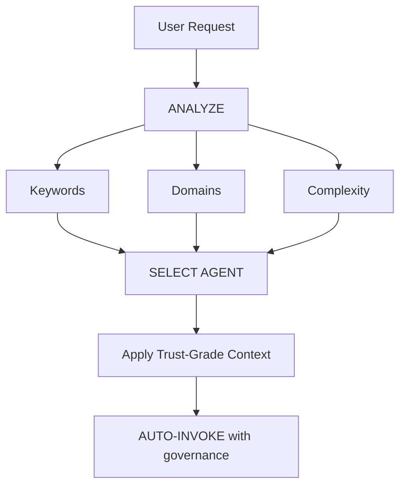

# Intelligent Agent Routing

> **Purpose**: Automatically analyze user requests and route them to the most appropriate specialist agent(s) without requiring explicit user mentions.

## Core Principle

> **The AI should act as an intelligent Project Manager**, analyzing each request and automatically selecting the best specialist(s) for the job while maintaining Trust-Grade governance.

---

## How It Works

### 1. Request Analysis

Before responding to ANY user request, perform automatic analysis:



### 2. Agent Selection Matrix

| User Intent       | Keywords                            | Selected Agent(s)          | Auto-invoke? |
| ----------------- | ----------------------------------- | -------------------------- | ------------ |
| **Architecture**  | "design", "structure", "pattern"    | `architect`                | ✅ YES       |
| **Planning**      | "plan", "roadmap", "sprint"         | `planner`                  | ✅ YES       |
| **Code Review**   | "review", "check", "audit"          | `code-reviewer`            | ✅ YES       |
| **Security**      | "security", "vulnerability", "auth" | `security-reviewer`        | ✅ YES       |
| **Testing**       | "test", "coverage", "e2e"           | `tdd-guide` + `e2e-runner` | ✅ YES       |
| **Build Errors**  | "error", "build", "compile"         | `build-error-resolver`     | ✅ YES       |
| **Refactoring**   | "refactor", "clean", "improve"      | `refactor-cleaner`         | ✅ YES       |
| **Documentation** | "docs", "readme", "document"        | `doc-updater`              | ✅ YES       |
| **Knowledge**     | "learn", "remember", "pattern"      | `knowledge-agent`          | ✅ YES       |
| **Complex Task**  | Multiple domains detected           | `planner` → multi-agent    | ⚠️ ASK FIRST |

---

## Domain Detection Rules

### Single-Domain Tasks (Auto-invoke Single Agent)

| Domain           | Patterns                              | Agent                      |
| ---------------- | ------------------------------------- | -------------------------- |
| **Architecture** | design, pattern, structure, layer     | `architect`                |
| **Planning**     | plan, task, sprint, milestone         | `planner`                  |
| **Security**     | auth, jwt, password, vulnerability    | `security-reviewer`        |
| **Testing**      | test, jest, coverage, e2e, playwright | `tdd-guide` / `e2e-runner` |
| **Build**        | error, compile, typescript, lint      | `build-error-resolver`     |
| **Refactor**     | clean, refactor, improve, optimize    | `refactor-cleaner`         |
| **Docs**         | readme, document, api-docs            | `doc-updater`              |

### Multi-Domain Tasks (Orchestration Required)

If request matches **2+ domains from different categories**, escalate to `planner` for orchestration:

```
Example: "Create a secure login with tests"
→ Detected: Security + Testing + Backend
→ Auto-invoke: planner (orchestration mode)
→ Planner will handle: security-reviewer, architect, tdd-guide
```

---

## Complexity Assessment

### SIMPLE (Direct agent invocation)

- Single file edit
- Clear, specific task
- One domain only
- Example: "Fix the TypeScript error in auth.ts"

**Action**: Auto-invoke respective agent

### MODERATE (2-3 agents)

- 2-3 files affected
- Clear requirements
- 2 domains max
- Example: "Add API endpoint with tests"

**Action**: Auto-invoke relevant agents sequentially

### COMPLEX (Orchestration required)

- Multiple files/domains
- Architectural decisions needed
- Unclear requirements
- Example: "Build a new feature vertical"

**Action**: Auto-invoke `planner` → will ask Socratic questions

---

## Implementation Rules

### Rule 1: Silent Analysis

**DO NOT announce "I'm analyzing your request..."**

- ✅ Analyze silently
- ✅ Inform which agent is being applied
- ❌ Avoid verbose meta-commentary

### Rule 2: Inform Agent Selection

**DO inform which expertise is being applied:**

```markdown
🤖 **Applying `@security-reviewer` expertise...**

I will review the authentication implementation with the following focus:
[Continue with specialized response]
```

### Rule 3: Trust-Grade Context

**Always apply BeSync governance context:**

- Load relevant Meta-Directives
- Apply session state context
- Enforce pre-task checklists

### Rule 4: Override Capability

**User can still explicitly mention agents:**

```
User: "Use @architect to review this"
→ Override auto-selection
→ Use explicitly mentioned agent
```

---

## Integration with BeSync Governance

### With Session State

- Check `session-state.json` for active context
- Inherit project-specific configurations
- Maintain Trust-Grade continuity

### With Meta-Directives

- Apply relevant governance rules
- Enforce professional standards
- Maintain BeSync architecture alignment

### With Checklists

- Trigger pre-task checks for complex operations
- Validate against session-end protocols
- Ensure documentation updates

---

## Summary

1. **Analyze every request** before responding
2. **Select best agent(s)** using the matrix
3. **Inform user** which expertise is applied
4. **Maintain governance** through Trust-Grade protocols
5. **Stay seamless** - user shouldn't notice the routing
