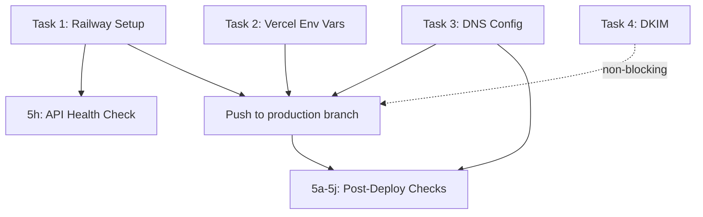

# Production Infrastructure — Pre-Launch Plan

> **Sprint**: Post-9 (Ad-Hoc) · **Date**: 2026-02-17
> **Scope**: Complete all remaining items from `TODO-pre-production.md` to achieve a deployable production state

---

## Background

Phase A (MVP) and Phase B Sprints 8-9 are complete. The CI/CD pipeline is operational (CI on push to `main`, Deploy on push to `production`). Vercel deploy pipeline has been tested (Deploy #3 ✅). What remains is connecting the external services, DNS, environment variables, and performing post-deploy verification.

---

## User Review Required

> [!IMPORTANT]
> **Railway Decision**: The plan assumes you have (or will create) a Railway account and token. If Railway is being deferred, Tasks 1 and 4b can be skipped — the deploy job will gracefully fail as it already does.

> [!IMPORTANT]
> **DNS Changes (GoDaddy)**: Tasks 3a-3c require DNS record changes at the GoDaddy registrar. These are manual actions that only you can perform.

> [!IMPORTANT]
> **Vercel Environment Variables**: Task 2 requires setting env vars in the Vercel Dashboard. This is a manual action performed by you.

---

## Proposed Tasks

### Task 1 — Railway Backend Setup

> **Who**: User (manual) · **Blocking**: deploy-api job

| Step | Action                                             | Notes                                                  |
| :--- | :------------------------------------------------- | :----------------------------------------------------- |
| 1a   | Create Railway project `pathforge-api`             | [railway.com/dashboard](https://railway.app/dashboard) |
| 1b   | Add Redis service within Railway project           | For JWT blacklist + ARQ task queue                     |
| 1c   | Set environment variables from production template | See table below                                        |
| 1d   | Generate `RAILWAY_TOKEN`                           | Account Settings → Tokens                              |
| 1e   | Add `RAILWAY_TOKEN` to GitHub Secrets              | Settings → Secrets → Actions                           |

**Railway Environment Variables Required:**

| Variable             | Source                                                                   |
| :------------------- | :----------------------------------------------------------------------- |
| `DATABASE_URL`       | Supabase PostgreSQL connection string                                    |
| `REDIS_URL`          | Railway-provisioned Redis (auto-injected)                                |
| `JWT_SECRET`         | Generate: `python -c "import secrets; print(secrets.token_urlsafe(48))"` |
| `JWT_REFRESH_SECRET` | Generate: same as above                                                  |
| `ENVIRONMENT`        | `production`                                                             |
| `CORS_ORIGINS`       | `https://pathforge.eu,https://www.pathforge.eu`                          |
| `VOYAGE_API_KEY`     | Voyage AI dashboard                                                      |
| `OPENAI_API_KEY`     | OpenAI dashboard (for LLM pipelines)                                     |

---

### Task 2 — Vercel Environment Variables

> **Who**: User (manual, Vercel Dashboard) · **Blocking**: production deploy

Set the following in **Vercel → Project → Settings → Environment Variables** (Production scope):

| Variable                        | Value                                                |
| :------------------------------ | :--------------------------------------------------- |
| `NEXT_PUBLIC_API_URL`           | `https://api.pathforge.eu` (or Railway-provided URL) |
| `NEXT_PUBLIC_GA_MEASUREMENT_ID` | `G-PJHB43EFLP`                                       |
| `NEXT_PUBLIC_GSC_VERIFICATION`  | _(your GSC verification code, if meta-tag approach)_ |
| `RESEND_API_KEY`                | From Resend dashboard (`pathforge-production` key)   |
| `RESEND_FROM_EMAIL`             | `PathForge <hello@pathforge.eu>`                     |
| `RESEND_AUDIENCE_ID`            | From Resend → Audiences → `PathForge Waitlist`       |

---

### Task 3 — DNS Configuration (GoDaddy)

> **Who**: User (manual, GoDaddy DNS) · **Blocking**: custom domain, API subdomain

| Step | Record Type | Host  | Value                   | Notes                                             |
| :--- | :---------- | :---- | :---------------------- | :------------------------------------------------ |
| 3a   | A           | `@`   | `76.76.21.21`           | Vercel IP for `pathforge.eu`                      |
| 3b   | CNAME       | `www` | `cname.vercel-dns.com`  | Vercel www redirect                               |
| 3c   | CNAME       | `api` | Railway-provided domain | Only if using `api.pathforge.eu`                  |
| 3d   | —           | —     | —                       | Verify SSL certs active (auto via Vercel/Railway) |

> [!NOTE]
> After setting DNS, add the custom domain in **Vercel → Project → Settings → Domains** → `pathforge.eu` + `www.pathforge.eu`.

---

### Task 4 — DKIM Verification

> **Who**: User (manual) · **Non-blocking**: email deliverability improvement

| Step | Action                                                           |
| :--- | :--------------------------------------------------------------- |
| 4a   | Check Google Workspace Admin → Apps → Gmail → Authenticate email |
| 4b   | If DKIM ready: generate key, add TXT record to GoDaddy DNS       |
| 4c   | Start DKIM verification in Admin Console                         |

> The 24-72h window started on 2026-02-17 ~03:00. Should be ready by now or within hours.

---

### Task 5 — Post-Deploy Verification (Agent-Assisted)

> **Who**: Agent + User · **After**: Tasks 1-3 are complete and first production deploy succeeds

These are items we can verify together once the site is live:

| #   | Check                       | How                                                                          |
| :-- | :-------------------------- | :--------------------------------------------------------------------------- |
| 5a  | Smoke test all public pages | Browser: visit `/`, `/features`, `/how-it-works`, `/contact`, `/about`, etc. |
| 5b  | Contact form email delivery | Submit contact form → verify email arrives at `emre@pathforge.eu`            |
| 5c  | Waitlist signup flow        | Submit waitlist form → verify Resend audience updated                        |
| 5d  | Cookie banner + GA4 consent | Verify banner appears, GA4 blocked by default, activates on accept           |
| 5e  | Lighthouse audit            | Run Lighthouse on production URL (aim 90+ all metrics)                       |
| 5f  | Open Graph / social preview | Check via [opengraph.xyz](https://opengraph.xyz)                             |
| 5g  | Submit sitemap to GSC       | GSC → Sitemaps → `https://pathforge.eu/sitemap.xml`                          |
| 5h  | API health check            | `curl https://api.pathforge.eu/api/v1/health`                                |
| 5i  | HSTS header present         | Check response headers on production                                         |
| 5j  | CORS verification           | Test API from frontend, verify no CORS errors                                |

---

## Task Dependency Graph

---

## What I Can Do vs. What You Need To Do

| Category        | Agent Can Do                                   | You Must Do                                  |
| :-------------- | :--------------------------------------------- | :------------------------------------------- |
| **Railway**     | Guide steps, verify health                     | Create project, set env vars, generate token |
| **Vercel**      | Guide steps                                    | Set env vars in dashboard, add custom domain |
| **DNS**         | Provide exact records                          | Update GoDaddy DNS panel                     |
| **DKIM**        | Guide steps                                    | Access Google Workspace Admin Console        |
| **Post-Deploy** | Run Lighthouse, test endpoints, verify headers | Submit GSC sitemap, visual QA                |

---

## Execution Order

1. **Task 1** (Railway) — _can be deferred if token not ready_
2. **Task 2** (Vercel env vars) — _quick, do now_
3. **Task 3** (DNS) — _do now, propagation takes 5-60 min_
4. **Task 4** (DKIM) — _check status now, takes ~5 min if ready_
5. **Task 5** (Post-deploy) — _after first successful deploy to production_

---

> **Estimated Time**: ~30 min for Tasks 1-4 (all manual), then ~20 min for Task 5 verification
