# PathForge Professional Project Tracking System

> **Version**: 1.1.0 | **Established**: 2026-02-14 | **Authority**: Emre Dursun — Product Owner
> **Classification**: Reference Architecture — Active Protocol

---

## 1. Executive Summary

The PathForge Professional Project Tracking System (PPTS) is a git-native, markdown-based, Single Source of Truth (SSOT) architecture for managing sprint planning, task tracking, and project delivery in an AI-agent-assisted development environment. It was designed through deep research into the engineering practices of **Google, Anthropic, OpenAI, Vercel, Stripe, Apple, and Amazon**, synthesized with best practices from **Linear, Cursor, Claude Code, and Windsurf** for AI coding agent session management.

### Design Goals

1. **Zero ambiguity** — Any question about "What sprint are we on?" or "What's next?" has exactly one answer, found in one file
2. **Zero manual effort** — Session hooks automate all tracking updates; the human never checks tracking files
3. **Zero duplication** — Task status exists in exactly one place; no reconciliation needed
4. **Git-native** — All tracking is version-controlled markdown; every change is auditable via `git log`
5. **Agent-proof** — Hard rules prevent the AI agent from inventing sprint numbers, guessing from memory, or creating duplicate tracking

---

## 2. Industry Research Foundation

### 2.1 Company-by-Company Analysis

| Company       | Engineering Practice                                                                                                                                                                                                                     | Key Insight                                                                                                 | PathForge Adoption                                                                                                         |
| :------------ | :--------------------------------------------------------------------------------------------------------------------------------------------------------------------------------------------------------------------------------------- | :---------------------------------------------------------------------------------------------------------- | :------------------------------------------------------------------------------------------------------------------------- |
| **Anthropic** | `CLAUDE.md` context engineering — structured markdown files auto-loaded into agent context for persistent memory. Token-aware sprint planning factors LLM compute into estimates. Multi-agent orchestration with specialized sub-agents. | _The better you document workflows, the better the AI performs._                                            | `.agent/rules/sprint-tracking.md` — always-loaded enforcement rules. Session hooks as automated orchestration layer.       |
| **Stripe**    | Writing culture where engineers produce design docs read silently in meetings. RFCs for technical decisions. Documentation integrated into career ladders. Docs treated as a product.                                                    | _One document per decision, read-before-discuss protocol._                                                  | `ROADMAP.md` as the living document. Sprint tracking rule requires reading ROADMAP.md before answering questions.          |
| **Amazon**    | Document-driven culture with narrative memos over presentations. Two-pizza teams with full service ownership. Proprietary tools (Brazil, Apollo) for build and program management.                                                       | _Narrative documents force clear thinking; small teams with ownership prevent diffusion of responsibility._ | Single-file SSOT eliminates scattered tracking. Ad-hoc work log provides narrative context for unplanned work.             |
| **Google**    | OKRs for strategic alignment. Rigorous code reviews with "Readability" certification. Knowledge sharing through internal Q&A. Proprietary tools (Borg, Blaze, Piper, Critique).                                                          | _Sprint velocity tracking enables data-driven planning; systematic validation prevents drift._              | Sprint velocity table in ROADMAP.md. Session-start hook validates sprint state against ARCHITECTURE.md.                    |
| **Vercel**    | RFC process for major changes. "Ship fast, iterate to greatness" culture. Preview deployments for every commit. Feature flags for safe incremental releases. Spaces dashboard for workflow monitoring.                                   | _Iterative delivery with clear versioning prevents big-bang failures._                                      | Changelog per sprint. Iterative sprint suffix notation (6a, 6b, 6a.1) allows adaptive planning without breaking numbering. |
| **Apple**     | PDCA (Plan-Do-Check-Act) cycle. Short, actionable documentation. Centralized leadership with cross-functional cooperation. Small, autonomous, high-impact teams.                                                                         | _Minimal documentation that is scannable and actionable beats comprehensive docs nobody reads._             | ROADMAP.md uses checkbox notation for instant scannability. Status markers visible at a glance.                            |
| **OpenAI**    | Multi-agent orchestration with Codex as "command center for agents." 5-tier progress tracking toward AGI. Agents SDK with guardrails for validation. Engineers shift to system design while agents handle implementation.                | _Session hooks act as the command center; guardrails (rules) prevent agent drift._                          | `sprint-tracking.md` includes Reject & Escalate table as guardrails. Session hooks orchestrate tracking automatically.     |
| **Linear**    | Cycles (sprints) with auto-rolling incomplete tasks. Velocity graphs for progress tracking. Real-time status updates. Deep GitHub integration with automatic issue status updates from PR activity.                                      | _Status markers + velocity tracking + auto-sync = zero manual tracking overhead._                           | `[ ]` `[/]` `[x]` `[-]` markers. Sprint velocity table. Session-end auto-syncs completed tasks.                            |

### 2.2 AI Coding Agent Session Management Patterns

| Pattern                      | Source                                                | Implementation                                                            |
| :--------------------------- | :---------------------------------------------------- | :------------------------------------------------------------------------ |
| **Externalized Memory**      | Cursor `.cursor/rules`, Claude `CLAUDE.md`            | `.agent/rules/sprint-tracking.md` — persistent rules loaded every session |
| **Structured Context Files** | `AGENTS.md`, `CLAUDE.md`, `NOTES.md` patterns         | `docs/ROADMAP.md` — structured markdown auto-loaded at session start      |
| **Session Bridging**         | Conversation summarization + context file handoff     | `session-context.md` for handoff notes (no task tracking)                 |
| **Focused Context**          | One concern per file, avoid mixing                    | Task tracking in ROADMAP.md only, metadata in session-state.json only     |
| **Agent Guardrails**         | OpenAI Agents SDK validation, Anthropic safety layers | Reject & Escalate rules in `sprint-tracking.md`                           |

---

## 3. System Architecture

### 3.1 File Architecture

```
pathforge/
├── docs/
│   ├── architecture/
│   │   └── ARCHITECTURE.md        # Sprint DEFINITIONS (read-only reference)
│   ├── ROADMAP.md                 # SSOT sprint board — the ONLY tracking file
│   └── CHANGELOG.md               # What shipped per sprint (Keep a Changelog)
├── .agent/
│   ├── rules/
│   │   └── sprint-tracking.md     # Agent enforcement rules (7 mandatory rules)
│   ├── checklists/
│   │   ├── session-start.md       # Sprint State Validation + Staleness Check
│   │   └── session-end.md         # Sprint State Sync + Verification
│   ├── session-context.md         # Working context pointers + handoff notes (~40 lines)
│   └── session-state.json         # Volatile-only metadata (v2.1.0 schema)
```

### 3.2 Data Flow

```mermaid
graph TD
    A["ARCHITECTURE.md\n(Sprint Definitions)"] -->|read-only| B["ROADMAP.md\n(SSOT Sprint Board)"]

    subgraph "Session Start"
        C["session-start.md"] -->|"1. Load"| B
        C -->|"2. Validate"| A
        C -->|"3. Present"| D["User sees:\n🔴 In-progress\n📋 Next priority\n⚠️ Blockers"]
    end

    subgraph "Session End"
        E["session-end.md"] -->|"1. Sync [x]"| B
        E -->|"2. Log changes"| F["CHANGELOG.md"]
        E -->|"3. Verify"| G["No duplicate\ntracking"]
    end

    H["sprint-tracking.md\n(Enforcement)"] -->|governs| B
    H -->|governs| C
    H -->|governs| E

    I["session-state.json"] -.->|pointer| B
    J["session-context.md"] -.->|pointer| B
```



### 3.3 Single Source of Truth Principle

| File                   | Tracks                                              | Does NOT Track                                |
| :--------------------- | :-------------------------------------------------- | :-------------------------------------------- |
| **ROADMAP.md**         | Task status, sprint identity, velocity, ad-hoc work | Session handoff notes, machine metadata       |
| **CHANGELOG.md**       | What shipped per sprint                             | Task status                                   |
| **session-context.md** | Working context pointers, handoff notes             | ❌ Task lists, ❌ Sprint status, ❌ File maps |
| **session-state.json** | Last commit, branch, test count (volatile only)     | ❌ Task arrays, ❌ Static project metadata    |
| **ARCHITECTURE.md**    | Sprint definitions (scope, deliverables)            | Task status (that's ROADMAP.md's job)         |

---

## 4. ROADMAP.md — SSOT Sprint Board Specification

### 4.1 Status Markers

| Symbol | Meaning          | When to Use                                          |
| :----- | :--------------- | :--------------------------------------------------- |
| `[ ]`  | Not started      | Default for new tasks                                |
| `[/]`  | In progress      | Task actively being worked on                        |
| `[x]`  | Completed        | Task verified and done                               |
| `[-]`  | Deferred/skipped | Task intentionally not done (with documented reason) |
| ✅     | Sprint complete  | All tasks in sprint are `[x]` or `[-]`               |
| 📋     | Current sprint   | Sprint actively being worked on                      |
| ⏳     | Upcoming sprint  | Sprint not yet started                               |

### 4.2 Sprint Naming Convention (Option C — Hybrid)

When unplanned work requires a separate sprint:

```
Sprint N        → Original definition from ARCHITECTURE.md
Sprint Na       → First inserted sprint (unplanned work)
Sprint Na.1     → Sub-sprint within inserted sprint
Sprint Nb       → Resumes original Sprint N definition
```

**Example**: Sprint 6 (Analytics) was deferred when navbar work emerged:

- Sprint 6a — Navbar & UI Excellence (completed, unplanned)
- Sprint 6a.1 — Performance Optimization (completed, unplanned)
- Sprint 6b — Analytics (current, resumes original Sprint 6)

### 4.3 Required Sections

1. **Header** — Last updated date, current sprint, current phase
2. **Legend** — Status marker definitions
3. **Sprint History** — All sprints with task checklists, ordered chronologically
4. **Ad-Hoc Work Log** — Table logging unplanned tasks with date, sprint context, status, notes
5. **Sprint Velocity** — Table tracking planned vs completed tasks, ad-hoc additions, session count

---

## 5. CHANGELOG.md — Per-Sprint Changelog Specification

Format follows [Keep a Changelog](https://keepachangelog.com/):

```markdown
## [Sprint Xa] — Sprint Name — YYYY-MM-DD

### Added

- New features or files

### Changed

- Modifications to existing features

### Fixed

- Bug fixes

### Removed

- Deleted features or files
```

---

## 6. Agent Enforcement Rules

> **Single Enforcement Point**: The 7 Mandatory Rules and Reject & Escalate matrix are defined in
> [sprint-tracking.md](file:///d:/ProfesionalDevelopment/AntigravityProjects/pathforge/.agent/rules/sprint-tracking.md).
> That file is the authoritative source. This section provides a summary for reference.

### 6.1 Summary of the 7 Mandatory Rules

1. **ROADMAP.md is the ONLY sprint tracking file** — prevents duplicate tracking
2. **Sprint numbers come from ARCHITECTURE.md only** — prevents invented sprint identities
3. **Session-start must load ROADMAP.md** and present current sprint state
4. **Session-end must sync ROADMAP.md** — mark completed tasks, log ad-hoc work
5. **Unplanned work gets a suffix** (6a, 6b) — never renumber existing sprints
6. **When answering sprint questions, read ROADMAP.md first** — never guess from memory
7. **Session-end must verify no duplicate tracking** across session files

> For the full Reject & Escalate matrix, see [sprint-tracking.md § Reject & Escalate](file:///d:/ProfesionalDevelopment/AntigravityProjects/pathforge/.agent/rules/sprint-tracking.md).

---

## 7. Session Hook Protocol

### 7.1 Session Start Flow

> Defined in [session-start.md](file:///d:/ProfesionalDevelopment/AntigravityProjects/pathforge/.agent/checklists/session-start.md).

```
┌─────────────────────────────────────────┐
│  🚀 SESSION START                       │
├─────────────────────────────────────────┤
│  1. Load session-context.md             │
│     └─ Handoff notes only               │
│  2. Load session-state.json             │
│     └─ Metadata only (commit, branch)   │
│  3. Load docs/ROADMAP.md (SSOT)         │
│     └─ Identify current sprint          │
│     └─ Identify [/] in-progress tasks   │
│     └─ Identify [ ] next priorities     │
│  4. Validate against ARCHITECTURE.md    │
│     └─ Sprint numbers match Section 7   │
│     └─ No drift between files           │
│  5. Present to user:                    │
│     ┌─────────────────────────────────┐ │
│     │ 🗺️ Sprint: 6b — Analytics      │ │
│     │ 🔴 In Progress: (none)          │ │
│     │ 📋 Next Priority:               │ │
│     │   1. Funnel pipeline tracking   │ │
│     │   2. Market intelligence dash   │ │
│     │   3. CV A/B tracking system     │ │
│     │ ⚠️ Deps: Backend API deployed    │ │
│     └─────────────────────────────────┘ │
│  6. Ready to work                       │
└─────────────────────────────────────────┘
```

### 7.2 Session End Flow

> Defined in [session-end.md](file:///d:/ProfesionalDevelopment/AntigravityProjects/pathforge/.agent/checklists/session-end.md).

```
┌─────────────────────────────────────────┐
│  🏁 SESSION END                         │
├─────────────────────────────────────────┤
│  1. Update docs/ROADMAP.md              │
│     └─ Completed tasks: [ ] → [x]       │
│     └─ In-progress tasks: [ ] → [/]     │
│     └─ Ad-hoc work → Ad-Hoc Log table  │
│     └─ Sprint velocity table updated    │
│  2. Update docs/CHANGELOG.md            │
│     └─ Session changes logged           │
│  3. Verify no duplicate tracking        │
│     └─ No task arrays in JSON           │
│     └─ No task lists in context.md      │
│  4. Update session-context.md           │
│     └─ Handoff notes only               │
│  5. Update session-state.json           │
│     └─ Commit, branch, test count       │
│  6. Commit + Push                       │
│     └─ All tracking files together      │
└─────────────────────────────────────────┘
```

### 7.3 Mid-Session (Continuous)

| Event                 | Automatic Action                          |
| :-------------------- | :---------------------------------------- |
| Task completed        | ROADMAP.md: `[ ]` → `[x]` immediately     |
| Unplanned work begins | ROADMAP.md: added to Ad-Hoc Work Log      |
| Sprint question asked | Agent reads ROADMAP.md before answering   |
| New task discovered   | Added to appropriate sprint in ROADMAP.md |

---

## 8. Anti-Patterns (What NOT to Do)

| ❌ Anti-Pattern                                    | ✅ Correct Approach                                   |
| :------------------------------------------------- | :---------------------------------------------------- |
| Track tasks in `session-state.json` `tasks` array  | Track tasks in `docs/ROADMAP.md` only                 |
| List open items in `session-context.md`            | Use `session-context.md` for handoff notes only       |
| Invent sprint numbers per conversation             | Use numbers from ARCHITECTURE.md with suffix notation |
| Answer sprint questions from memory                | Read ROADMAP.md first, then answer                    |
| Create separate sprint docs (`sprint-6-navbar.md`) | Use ROADMAP.md sections with per-sprint headers       |
| Skip ROADMAP.md sync at session end                | Always sync — it's the SSOT                           |
| Track same task in multiple files                  | One task, one file, one checkbox                      |

---

## 9. File Reference

| File                 | Path                                                                                                                   | Role                                   |
| :------------------- | :--------------------------------------------------------------------------------------------------------------------- | :------------------------------------- |
| SSOT Sprint Board    | [ROADMAP.md](file:///d:/ProfesionalDevelopment/AntigravityProjects/pathforge/docs/ROADMAP.md)                          | Task status, sprint identity, velocity |
| Per-Sprint Changelog | [CHANGELOG.md](file:///d:/ProfesionalDevelopment/AntigravityProjects/pathforge/docs/CHANGELOG.md)                      | What shipped each sprint               |
| Agent Enforcement    | [sprint-tracking.md](file:///d:/ProfesionalDevelopment/AntigravityProjects/pathforge/.agent/rules/sprint-tracking.md)  | 7 mandatory rules (single enforcement) |
| Session Start        | [session-start.md](file:///d:/ProfesionalDevelopment/AntigravityProjects/pathforge/.agent/checklists/session-start.md) | Validation + staleness detection       |
| Session End          | [session-end.md](file:///d:/ProfesionalDevelopment/AntigravityProjects/pathforge/.agent/checklists/session-end.md)     | Sync + verification                    |
| Sprint Definitions   | [ARCHITECTURE.md](file:///d:/ProfesionalDevelopment/AntigravityProjects/pathforge/docs/architecture/ARCHITECTURE.md)   | Master roadmap (Section 7)             |
| Session Handoff      | [session-context.md](file:///d:/ProfesionalDevelopment/AntigravityProjects/pathforge/.agent/session-context.md)        | Working context + handoff notes        |
| Volatile Metadata    | [session-state.json](file:///d:/ProfesionalDevelopment/AntigravityProjects/pathforge/.agent/session-state.json)        | Volatile-only (v2.1.0 schema)          |

---

## 10. Version History

| Date       | Version | Change                                                                                                               |
| :--------- | :------ | :------------------------------------------------------------------------------------------------------------------- |
| 2026-02-15 | 1.1.0   | Resolved 8 audit findings — slimmed session files, deduped rules, added staleness detection, honest labeling         |
| 2026-02-14 | 1.0.0   | Initial system establishment — 7-company research, SSOT architecture, session hook protocol, agent enforcement rules |
