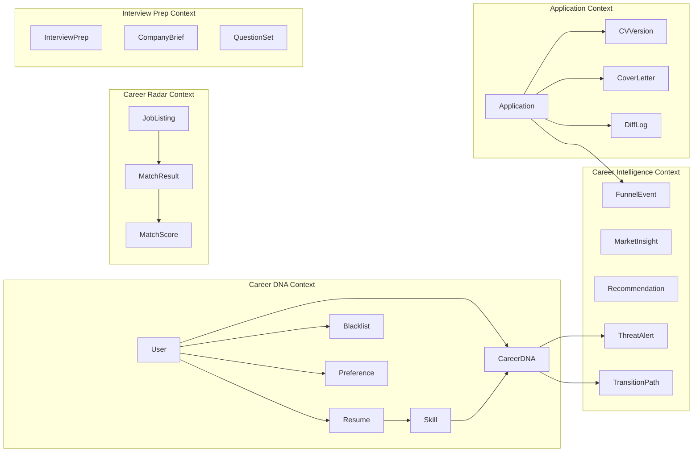

# PathForge — Career Intelligence Platform

> **Architecture Decision Record** | **Classification**: Senior Engineer Reference
> **Version**: 1.1.0 | **Date**: 2026-02-10
> **Author**: Career Intelligence Platform Architect (Antigravity AI Kit v2.0.0)
> **Status**: APPROVED — Ready for Phase 1 Implementation

---

## 1. Product Vision

PathForge is a **Career Intelligence Platform** — the Waze for careers.

**Mission:** _Democratize career intelligence._

> Enterprise-grade career intelligence — Skills Graphs, Market Signals, Predictive Analytics — has been locked behind $100K+ enterprise contracts (LinkedIn, Gloat, Workday, Eightfold). PathForge makes this intelligence available to every individual professional.

**Vision:** _A world where no career decision is made blind._

### 1.1 Career DNA™

Every user has a living, multi-dimensional **Career DNA™** — not a static CV:

| Dimension              | What It Captures                                 | Source                      |
| :--------------------- | :----------------------------------------------- | :-------------------------- |
| **Skills Genome**      | Explicit + hidden transferable skills            | CV analysis + AI extraction |
| **Experience Pattern** | Career trajectory and velocity                   | Timeline + role analysis    |
| **Growth Vector**      | Where you're heading, not just where you've been | Trend projection            |
| **Values Alignment**   | Culture, impact, autonomy preferences            | Preference profiling        |
| **Market Position**    | Real-time standing vs. demand                    | Market intelligence         |
| **Opportunity Radar**  | Emerging fits before they're posted              | Predictive matching         |

Career DNA is **alive** (updates continuously), **predictive** (future fit, not just current), **yours** (GDPR-native, data sovereign), and **proactive** (alerts without asking).

### 1.2 The PathForge Manifesto

1. **Your career data is YOUR intelligence** — not a recruiter's inventory
2. **Proactive, not reactive** — career guidance before crisis, not after layoff
3. **Evidence over intuition** — every recommendation backed by market data
4. **Precision over volume** — one right move beats 100 blind applications
5. **Human-first AI** — technology amplifies decisions, never replaces judgment
6. **Transparent AI** — every score, match, and recommendation is explainable
7. **EU-native privacy** — GDPR is not a compliance burden, it's trust architecture

---

## 2. System Architecture

### 2.1 High-Level Overview

```
┌─────────────────────────────────────────────────────────────────┐
│                        CLIENT LAYER                             │
│  ┌──────────────┐  ┌──────────────┐  ┌──────────────────────┐  │
│  │   Next.js    │  │ React Native │  │    React Native      │  │
│  │   Web App    │  │ Android App  │  │    iOS App           │  │
│  │  (Vercel)    │  │   (Expo)     │  │    (Expo)            │  │
│  └──────┬───────┘  └──────┬───────┘  └──────────┬───────────┘  │
└─────────┼─────────────────┼─────────────────────┼──────────────┘
          │                 │                     │
          └─────────────────┼─────────────────────┘
                            │ HTTPS / REST API v1
┌───────────────────────────┼─────────────────────────────────────┐
│                    API GATEWAY LAYER                             │
│  ┌────────────────────────┴──────────────────────────────────┐  │
│  │              FastAPI (Python 3.12+)                        │  │
│  │              JWT Auth + Rate Limiting                      │  │
│  │              OpenAPI Auto-Documentation                    │  │
│  │              (Railway — managed hosting)                   │  │
│  └───────┬──────────┬──────────┬──────────┬──────────────────┘  │
└──────────┼──────────┼──────────┼──────────┼─────────────────────┘
           │          │          │          │
┌──────────┼──────────┼──────────┼──────────┼─────────────────────┐
│          │    DOMAIN SERVICE LAYER       │                       │
│  ┌───────┴───┐ ┌────┴────┐ ┌───┴────┐ ┌──┴──────────┐          │
│  │ Profile   │ │ Matching│ │ Appli- │ │ Interview   │          │
│  │ Domain    │ │ Domain  │ │ cation │ │ Prep Domain │          │
│  │           │ │         │ │ Domain │ │             │          │
│  └───────────┘ └─────────┘ └────────┘ └─────────────┘          │
│  ┌───────────────────────────────────────────────┐              │
│  │              Analytics Domain                  │              │
│  └───────────────────────────────────────────────┘              │
└──────────┬──────────┬──────────┬────────────────────────────────┘
           │          │          │
┌──────────┼──────────┼──────────┼────────────────────────────────┐
│          │   AI ENGINE LAYER   │                                 │
│  ┌───────┴───────────┴─────────┴───────────────────────────┐    │
│  │  ┌─────────────┐  ┌─────────────┐  ┌─────────────────┐ │    │
│  │  │ Embedding   │  │ Generation  │  │ Analysis        │ │    │
│  │  │ Service     │  │ Service     │  │ Service         │ │    │
│  │  │ (Voyage AI) │  │(Sonnet 4.5) │  │ (Sonnet 4.5)    │ │    │
│  │  └─────────────┘  └─────────────┘  └─────────────────┘ │    │
│  │  LangChain Router: Sonnet→Flash→Opus by task complexity  │    │
│  └──────────────────────────────────────────────────────────┘    │
│  ┌──────────────────────────────────────────────────────────┐    │
│  │           Automation Engine (Playwright)                  │    │
│  │           Celery Workers (Redis-backed)                   │    │
│  └──────────────────────────────────────────────────────────┘    │
└──────────┬──────────┬──────────┬────────────────────────────────┘
           │          │          │
┌──────────┼──────────┼──────────┼────────────────────────────────┐
│          │   DATA LAYER        │                                 │
│  ┌───────┴────┐  ┌──┴──────┐  ┌┴────────────┐                  │
│  │ PostgreSQL │  │  Redis  │  │ S3 Object   │                  │
│  │ + pgvector │  │  Cache  │  │ Storage     │                  │
│  │ (Supabase) │  │  Queue  │  │ (CV PDFs)   │                  │
│  └────────────┘  └─────────┘  └─────────────┘                  │
└─────────────────────────────────────────────────────────────────┘
```

### 2.2 Tech Stack

| Layer              | Technology              | Version | Hosting                |
| :----------------- | :---------------------- | :------ | :--------------------- |
| Frontend (Web)     | Next.js (App Router)    | 15.x    | Vercel                 |
| Frontend (Mobile)  | React Native + Expo     | SDK 52+ | App Store / Play Store |
| Backend API        | FastAPI (Python)        | 3.12+   | Railway                |
| AI/LLM (Primary)   | Anthropic Claude Sonnet | 4.5     | Anthropic API          |
| AI/LLM (Fast)      | Google Gemini Flash     | 3       | Google AI API          |
| AI/LLM (Deep)      | Anthropic Claude Opus   | 4.6     | Anthropic API          |
| Embeddings         | Voyage AI               | Latest  | API                    |
| Vector DB          | pgvector (PostgreSQL)   | 16.x    | Supabase               |
| Primary DB         | PostgreSQL              | 16.x    | Supabase               |
| Cache/Queue        | Redis + BullMQ          | 7.x     | Railway                |
| Task Worker        | Celery (Python)         | 5.x     | Railway                |
| Browser Automation | Playwright (Python)     | Latest  | Worker containers      |
| Object Storage     | S3-compatible           | —       | Supabase Storage       |
| Auth               | JWT + OAuth2            | —       | FastAPI native         |
| Containerization   | Docker + Compose        | —       | Local dev / Railway    |

### 2.3 Key Architecture Decisions (ADRs)

#### ADR-001: Python/FastAPI Over Node.js/NestJS

**Decision**: Use Python with FastAPI as the primary backend.

**Context**: PathForge's core value proposition is AI-driven — semantic matching, CV generation, skill gap analysis. The AI/ML ecosystem is Python-native (LangChain, Anthropic SDK, sentence-transformers, spaCy, Playwright).

**Rationale**:

- Single-language AI pipeline (no Python↔Node bridging)
- FastAPI provides: async I/O, OpenAPI auto-docs, Pydantic validation
- Native access to all AI/ML libraries without subprocess calls
- Superior type safety via Pydantic + mypy strict mode

**Trade-off**: Web frontend team uses TypeScript. Mitigated by shared API contract (OpenAPI) and code-generated TypeScript client.

#### ADR-002: pgvector Over Dedicated Vector DB

**Decision**: Use pgvector extension in PostgreSQL instead of Pinecone/Weaviate/Milvus.

**Context**: Vector similarity search is needed for semantic matching between job listings and user profiles.

**Rationale**:

- Single database for relational AND vector data = simpler ops
- HNSW index provides sub-100ms queries at expected scale
- No additional service to manage, monitor, or pay for
- Supabase provides pgvector out of the box
- Migration path to dedicated vector DB exists if scale demands it

#### ADR-003: Managed Hosting Over Self-Hosted

**Decision**: Vercel (web) + Railway (API/workers) + Supabase (DB).

**Context**: Solo/small team needs to minimize operational overhead.

**Rationale**:

- Zero server maintenance, auto-scaling, managed backups
- Railway Docker support provides future K8s migration path
- Cost-efficient at early scale (~$25-50/month)
- All three platforms support environment-based config and secrets management

#### ADR-004: Human-in-the-Loop Over Full Automation

**Decision**: All application submissions require explicit user approval by default.

**Context**: Competitors like LazyApply offer mass-apply features that violate employer ToS and damage candidate reputation.

**Rationale**:

- Respects employer platform Terms of Service
- Prevents reputation damage from generic/mismatched applications
- GDPR Article 22 compliance (automated decision-making with significant effects)
- Full-auto mode only available via explicit, informed consent toggle
- Builds user trust through transparency and control

#### ADR-005: Multi-Provider Tiered LLM Strategy

**Decision**: Use a tiered multi-provider approach instead of a single LLM for all tasks.

**Context**: PathForge has diverse AI workloads with vastly different complexity and volume requirements. Using Claude Opus 4.6 for everything would cost ~$300-600/mo at 1000 users.

**Strategy** _(verified pricing as of Feb 2026)_:

| Tier              | Model             | Usage               | Cost In/Out (per M tokens) | Tasks                                                           |
| :---------------- | :---------------- | :------------------ | :------------------------- | :-------------------------------------------------------------- |
| **Primary (80%)** | Claude Sonnet 4.5 | Workhorse           | $3 / $15                   | CV/CL generation, match explanations, skill gap, interview prep |
| **Fast (15%)**    | Gemini 3 Flash    | High-volume, simple | $0.50 / $3                 | Resume parsing, classification, quick summaries                 |
| **Deep (5%)**     | Claude Opus 4.6   | Complex reasoning   | $5 / $25                   | Career strategy, multi-source deep analysis                     |

**Rationale**:

- Sonnet 4.5 delivers ~90% of Opus quality at ~60% of the cost
- Gemini 3 Flash handles high-volume parsing at low cost ($0.50/$3)
- Opus at $5/$25 is affordable enough to use more generously for deep reasoning
- LangChain abstraction routes tasks to appropriate model automatically
- Estimated cost: **~$75-190/mo** vs. $300-600 (Opus-only) for 1000 users
- A/B testing across providers enabled without code changes

#### ADR-006: LangChain Provider Abstraction

**Decision**: All LLM calls go through LangChain, never directly to provider SDKs.

**Context**: Multi-provider strategy requires a clean routing layer.

**Rationale**:

- Swap or add providers without touching business logic
- Task-based model routing via configuration
- Unified prompt template system across all providers
- Built-in retry, fallback, and observability
- Future-proof against provider pricing/capability changes

---

## 3. Domain Model

### 3.1 Bounded Contexts



### 3.2 Core Entity Definitions

| Entity           | Description                          | Key Fields                                                             |
| :--------------- | :----------------------------------- | :--------------------------------------------------------------------- |
| `User`           | Platform user account                | id, email, name, auth_provider, created_at                             |
| `Resume`         | Parsed, structured CV data           | id, user_id, raw_text, structured_data, embedding, version             |
| `Skill`          | Individual competency                | id, name, category, proficiency_level, verified                        |
| `Blacklist`      | Company exclusion list               | id, user_id, company_name, reason, is_current_employer                 |
| `Preference`     | Job search preferences               | id, user_id, locations, salary_range, work_type, sectors               |
| `JobListing`     | Scraped/imported job posting         | id, title, company, description, embedding, source_url, posted_at      |
| `MatchResult`    | Semantic match between user and job  | id, user_id, job_id, overall_score, explanation, created_at            |
| `MatchScore`     | Dimensional scoring breakdown        | id, match_id, dimension, score, rationale                              |
| `Application`    | Tracked job application              | id, user_id, job_id, cv_version_id, status, submitted_at               |
| `CVVersion`      | Tailored CV for specific application | id, resume_id, job_id, content, diff_from_base, generation_log         |
| `CoverLetter`    | Generated cover letter               | id, application_id, content, tone, generation_log                      |
| `DiffLog`        | CV customization changelog           | id, cv_version_id, field, original, modified, reason                   |
| `InterviewPrep`  | Interview preparation bundle         | id, application_id, company_brief, questions, star_examples            |
| `FunnelEvent`    | Application lifecycle event          | id, application_id, stage, timestamp, metadata                         |
| `MarketInsight`  | Aggregated market intelligence       | id, user_id, insight_type, data, period, generated_at                  |
| `CareerDNA`      | Living multi-dimensional profile     | id, user_id, skills_genome, growth_vector, market_position, updated_at |
| `ThreatAlert`    | Proactive career threat detection    | id, user_id, alert_type, severity, message, action_items               |
| `TransitionPath` | Proven career transition pathway     | id, from_role, to_role, success_rate, avg_duration, required_skills    |

---

## 4. AI Pipeline Architecture

### 4.1 Semantic Matching Pipeline

```
              ┌─────────────────┐
              │   Job Listing   │
              │   (raw text)    │
              └────────┬────────┘
                       │
              ┌────────▼────────┐
              │    NLP Parser   │
              │ (spaCy + rules) │
              └────────┬────────┘
                       │
              ┌────────▼────────┐        ┌──────────────────┐
              │  Voyage AI /    │        │   User Profile    │
              │  Embedding API  │        │   (structured)    │
              └────────┬────────┘        └────────┬─────────┘
                       │                          │
              ┌────────▼────────┐        ┌────────▼─────────┐
              │  Job Embedding  │        │ Profile Embedding │
              │  (3072-dim vec) │        │  (3072-dim vec)   │
              └────────┬────────┘        └────────┬─────────┘
                       │                          │
                       └──────────┬───────────────┘
                                  │
                       ┌──────────▼───────────┐
                       │  pgvector HNSW       │
                       │  Cosine Similarity   │
                       │  Top-K Query         │
                       └──────────┬───────────┘
                                  │
                       ┌──────────▼───────────┐
                       │  Claude Sonnet 4.5   │
                       │  Explanation Layer   │
                       │  "Why this matches"  │
                       └──────────┬───────────┘
                                  │
                       ┌──────────▼───────────┐
                       │   Ranked Results     │
                       │   + Explanations     │
                       └──────────────────────┘
```

### 4.2 CV Tailoring Pipeline

```
Input: (Job Listing + User Profile + Match Analysis)
                          │
               ┌──────────▼───────────┐
               │   Prompt Engineering  │
               │   (domain templates) │
               └──────────┬───────────┘
                          │
               ┌──────────▼───────────┐
               │   Claude Sonnet 4.5  │
               │   CV Draft Gen       │
               └──────────┬───────────┘
                          │
               ┌──────────▼───────────┐
               │   Diff Engine        │
               │   (field-by-field)   │
               │   What changed + Why │
               └──────────┬───────────┘
                          │
               ┌──────────▼───────────┐
               │   ATS Compliance     │
               │   Validator          │
               └──────────┬───────────┘
                          │
               ┌──────────▼───────────┐
               │   Human Review       │
               │   + Manual Override  │
               └──────────┬───────────┘
                          │
               ┌──────────▼───────────┐
               │   Final CV Version   │
               │   (versioned + logged)│
               └──────────────────────┘
```

### 4.3 Key Design Decisions

| Decision           | Choice                       | Rationale                                               |
| :----------------- | :--------------------------- | :------------------------------------------------------ |
| Embedding model    | Voyage AI `voyage-3-large`   | Optimized for professional/technical text               |
| Primary generation | Claude Sonnet 4.5            | 90% of Opus quality at 20% cost — best $/performance    |
| Fast parsing       | Gemini 2.5 Flash             | Near-zero cost for high-volume structured extraction    |
| Deep reasoning     | Claude Opus 4.6              | Reserved for complex career strategy only (5% of calls) |
| Vector index       | HNSW (pgvector)              | Sub-100ms at expected scale                             |
| Prompt management  | Version-controlled templates | A/B testable, auditable                                 |
| Provider routing   | LangChain Router             | Task-based model selection, unified prompt system       |
| Fallback chain     | Sonnet → Flash → raw scores  | Multi-level graceful degradation                        |

---

## 5. Ethics, Privacy & Safety

### 5.1 GDPR Compliance

| Principle         | Implementation                                                          |
| :---------------- | :---------------------------------------------------------------------- |
| Data Minimization | Only store what's needed; CV text → structured data, raw optional       |
| Right to Erasure  | One-click account + data deletion, cascading all tables                 |
| Consent           | Explicit opt-in for: automation, data storage, AI processing            |
| Transparency      | AI decision explanations on every match and CV change                   |
| Data Portability  | Export all user data as JSON/PDF                                        |
| Retention Limits  | Auto-purge inactive data after configurable period (default: 12 months) |

### 5.2 Automation Safety

| Control        | Implementation                                                                 |
| :------------- | :----------------------------------------------------------------------------- |
| Rate Limiting  | Max 10 applications/hour, 30/day (configurable per user)                       |
| Human Approval | Default: swipe/approve before submission                                       |
| Blacklist      | User-defined exclusions + current employer auto-protection                     |
| Bot Detection  | Realistic delays, fingerprint hygiene, session rotation                        |
| ToS Compliance | Official APIs where available; browser automation as informed-consent fallback |
| Audit Trail    | Every action logged: timestamp, CV version, approval status                    |

### 5.3 Risk Matrix

| Risk                 | Severity | Probability | Mitigation                                                         |
| :------------------- | :------- | :---------- | :----------------------------------------------------------------- |
| AI bias in matching  | High     | Medium      | Multi-dimensional scoring, explainable results, user feedback loop |
| Employer account ban | High     | Low         | Rate limits, human approval, realistic behavior patterns           |
| Data breach          | Critical | Low         | Encryption at rest (AES-256), TLS in transit, Supabase RLS         |
| LLM hallucination    | Medium   | Medium      | Output validation, diff-based changes only, human review           |
| GDPR violation       | High     | Low         | Privacy-by-design, consent management, data minimization           |

---

## 6. Monorepo Structure

```
pathforge/
├── .agent/                         # Antigravity AI Kit v2.0.0
├── apps/
│   ├── web/                        # Next.js 15 (App Router)
│   │   ├── app/                    # Pages and layouts
│   │   ├── components/             # UI components
│   │   ├── lib/                    # Utilities + API client
│   │   └── public/                 # Static assets
│   ├── mobile/                     # React Native + Expo
│   │   ├── app/                    # Expo Router
│   │   ├── components/             # RN components
│   │   └── lib/                    # Utilities
│   └── api/                        # FastAPI backend
│       ├── app/
│       │   ├── core/               # Config, security, deps
│       │   ├── models/             # SQLAlchemy ORM models
│       │   ├── schemas/            # Pydantic request/response DTOs
│       │   ├── services/           # Business logic layer
│       │   ├── api/v1/             # Versioned route handlers
│       │   ├── ai/                 # AI engine modules
│       │   │   ├── embeddings/     # Vector operations
│       │   │   ├── matching/       # Semantic matching
│       │   │   ├── generation/     # CV/CL generation
│       │   │   └── analysis/       # Skill gap, market intel
│       │   ├── automation/         # Playwright workflows
│       │   └── workers/            # Celery async tasks
│       ├── alembic/                # Database migrations
│       ├── tests/                  # pytest suite
│       └── pyproject.toml          # Python project config
├── packages/
│   └── shared/                     # Shared TS types/constants
├── docker/
│   ├── docker-compose.yml          # Dev environment
│   ├── Dockerfile.api
│   ├── Dockerfile.web
│   └── Dockerfile.worker
├── docs/                           # Architecture docs (this file)
│   └── architecture/
├── package.json                    # pnpm workspace root
├── pnpm-workspace.yaml
└── README.md
```

---

## 7. Delivery Roadmap

### Phase A: Core Platform (MVP)

| Phase | Focus               | Duration     | Key Deliverables                                                        |
| :---- | :------------------ | :----------- | :---------------------------------------------------------------------- |
| **1** | Foundation          | 2-3 sessions | Monorepo, FastAPI, DB schema, JWT auth, Docker Compose                  |
| **2** | AI Engine           | 3-4 sessions | Resume parsing, embeddings, semantic matching, CV tailoring, skill gaps |
| **3** | Web App             | 3-4 sessions | Next.js UI, onboarding, Career Radar dashboard, interview prep          |
| **4** | Automation          | 2-3 sessions | Playwright, form filling, safety controls, application logging          |
| **5** | Analytics           | 2 sessions   | Funnel pipeline, market intelligence, CV A/B tracking                   |
| **6** | Mobile + Production | 3-4 sessions | Expo mobile app, push notifications, security audit, monitoring         |

> **Architecture note**: Career DNA data schema is baked in from Phase 1. Every feature generates Career DNA signals, even before the intelligence layer is activated.

### Phase B: Career Intelligence (Post-MVP, 3-6 months)

| Phase | Focus                 | Key Deliverables                                                   |
| :---- | :-------------------- | :----------------------------------------------------------------- |
| **7** | Career DNA Activation | Living Career DNA profiles, hidden skills discovery, growth vector |
| **8** | Career Weather        | Market signal aggregation, skill demand trends, threat alerts      |
| **9** | Transition Pathways   | Anonymized career movement patterns, proven pivot paths            |

### Phase C: Network Intelligence (6-12 months)

| Phase  | Focus                    | Key Deliverables                                                     |
| :----- | :----------------------- | :------------------------------------------------------------------- |
| **10** | Collective Intelligence  | Anonymized career movement analytics, industry pulse, salary compass |
| **11** | Predictive Career Engine | Emerging role detection, proactive opportunity surfacing             |

**Total estimated**: ~16-20 sessions for MVP, ~24-30 sessions for full Career Intelligence Platform.

---

## 8. Competitive Differentiators Summary

### 8.1 Category-Level Differentiation

| Market Segment                             | What They Do                               | What PathForge Does                            |
| :----------------------------------------- | :----------------------------------------- | :--------------------------------------------- |
| Job search tools (Teal, Jobscan, Huntr)    | Optimize the existing job search loop      | **Replaces the loop with Career Intelligence** |
| Mass apply bots (LazyApply, AIApply)       | Spray-and-pray automation                  | **Precision-and-strategy, human-first**        |
| Enterprise HR platforms (Gloat, Eightfold) | Career intelligence for employers ($100K+) | **Same intelligence, for individuals**         |
| LinkedIn Skills Graph                      | Recruiter-facing skills data               | **Individual-facing Career DNA™**              |

### 8.2 Feature-Level Differentiation

| What exists today                  | What PathForge does differently                      |
| :--------------------------------- | :--------------------------------------------------- |
| Keyword matching (Jobscan, Rezi)   | Semantic vector similarity + LLM reasoning           |
| Static CV (everywhere)             | Living Career DNA™ — evolves continuously            |
| Reactive job search (event-driven) | Proactive Career Radar — opportunities find you      |
| No career forecasting              | Career Weather — skill demand trends + threat alerts |
| No proven career paths             | Transition Pathways — evidence-based pivot routes    |
| Mass auto-apply (LazyApply)        | Human-approved semi-automation                       |
| Basic job tracker (Teal, Huntr)    | Full funnel analytics + market intelligence          |
| No skill gap analysis              | ROI-quantified gaps with learning recommendations    |
| No ethics layer                    | Blacklists, consent management, GDPR, audit trails   |
| Opaque AI decisions                | Full explainability on every match and CV change     |

---

## 9. Success Metrics

### 9.1 Core Platform Metrics (MVP)

| Metric                        | Target                    | Measurement                |
| :---------------------------- | :------------------------ | :------------------------- |
| Application-to-interview rate | >15% (industry avg: 2-5%) | Funnel tracking            |
| CV match score accuracy       | >85% user agreement       | Feedback loop              |
| Time-to-apply (per job)       | <3 minutes                | Application timestamps     |
| User retention (30-day)       | >60%                      | Active user tracking       |
| GDPR compliance               | 100%                      | Audit checklist            |
| AI explainability coverage    | 100% of decisions         | Explanation presence check |

### 9.2 Career Intelligence Metrics (Post-MVP)

| Metric                        | Target                     | Measurement            |
| :---------------------------- | :------------------------- | :--------------------- |
| Career DNA completeness       | >80% of profile dimensions | Profile analysis       |
| Hidden skills discovered/user | >3 per analysis            | AI extraction audit    |
| Proactive alert engagement    | >40% open rate             | Notification analytics |
| Threat alert lead time        | >60 days before crisis     | Market signal accuracy |
| Transition pathway accuracy   | >70% user-validated        | Feedback loop          |

---

> **Document Classification**: Senior Engineer Architecture Reference
> **Maintained by**: Antigravity AI Kit v2.0.0 Cognitive Engine
> **Review Cadence**: Updated at each phase boundary
