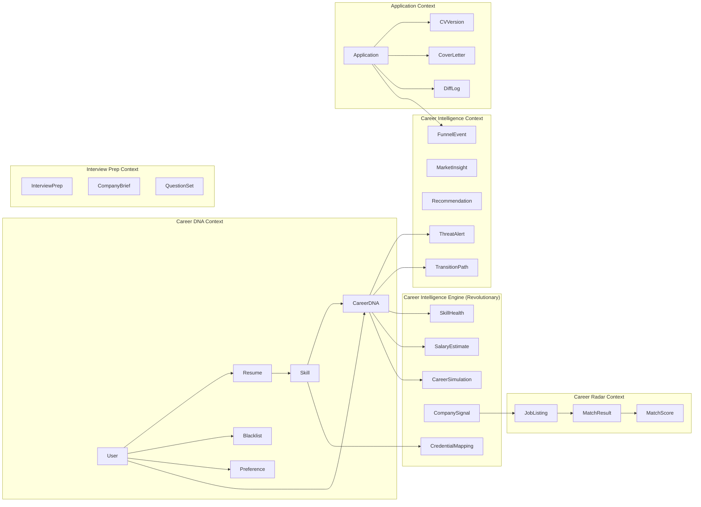

# PathForge — Career Intelligence Platform

> **Architecture Decision Record** | **Classification**: Senior Engineer Reference
> **Version**: 2.0.0 | **Date**: 2026-02-11
> **Author**: Career Intelligence Platform Architect (Antigravity AI Kit v2.0.0)
> **Status**: APPROVED — Quality-Gate Audited, Ready for Implementation

---

## 1. Product Vision

PathForge is a **Career Intelligence Platform** — the Waze for careers.

**Mission:** _Democratize career intelligence._

> Enterprise-grade career intelligence — Skills Graphs, Market Signals, Predictive Analytics — has been locked behind $100K+ enterprise contracts (LinkedIn, Gloat, Workday, Eightfold). PathForge makes this intelligence available to every individual professional.

**Vision:** _A world where no career decision is made blind._

### 1.1 Career DNA™

Every user has a living, multi-dimensional **Career DNA™** — not a static CV:

| Dimension              | What It Captures                                 | Source                      |
| :--------------------- | :----------------------------------------------- | :-------------------------- |
| **Skills Genome**      | Explicit + hidden transferable skills            | CV analysis + AI extraction |
| **Experience Pattern** | Career trajectory and velocity                   | Timeline + role analysis    |
| **Growth Vector**      | Where you're heading, not just where you've been | Trend projection            |
| **Values Alignment**   | Culture, impact, autonomy preferences            | Preference profiling        |
| **Market Position**    | Real-time standing vs. demand                    | Market intelligence         |
| **Opportunity Radar**  | Emerging fits before they're posted              | Predictive matching         |

Career DNA is **alive** (updates continuously), **predictive** (future fit, not just current), **yours** (GDPR-native, data sovereign), and **proactive** (alerts without asking).

### 1.2 The PathForge Manifesto

1. **Your career data is YOUR intelligence** — not a recruiter's inventory
2. **Proactive, not reactive** — career guidance before crisis, not after layoff
3. **Evidence over intuition** — every recommendation backed by market data
4. **Precision over volume** — one right move beats 100 blind applications
5. **Human-first AI** — technology amplifies decisions, never replaces judgment
6. **Transparent AI** — every score, match, and recommendation is explainable
7. **EU-native privacy** — GDPR is not a compliance burden, it's trust architecture

---

## 2. System Architecture

### 2.1 High-Level Overview

```
┌─────────────────────────────────────────────────────────────────┐
│                        CLIENT LAYER                             │
│  ┌──────────────┐  ┌──────────────┐  ┌──────────────────────┐  │
│  │   Next.js    │  │ React Native │  │    React Native      │  │
│  │   Web App    │  │ Android App  │  │    iOS App           │  │
│  │  (Vercel)    │  │   (Expo)     │  │    (Expo)            │  │
│  └──────┬───────┘  └──────┬───────┘  └──────────┬───────────┘  │
└─────────┼─────────────────┼─────────────────────┼──────────────┘
          │                 │                     │
          └─────────────────┼─────────────────────┘
                            │ HTTPS / REST API v1
┌───────────────────────────┼─────────────────────────────────────┐
│                    API GATEWAY LAYER                             │
│  ┌────────────────────────┴──────────────────────────────────┐  │
│  │              FastAPI (Python 3.12+)                        │  │
│  │              JWT Auth + Rate Limiting                      │  │
│  │              OpenAPI Auto-Documentation                    │  │
│  │              (Railway — managed hosting)                   │  │
│  └───────┬──────────┬──────────┬──────────┬──────────────────┘  │
└──────────┼──────────┼──────────┼──────────┼─────────────────────┘
           │          │          │          │
┌──────────┼──────────┼──────────┼──────────┼─────────────────────┐
│          │    DOMAIN SERVICE LAYER       │                       │
│  ┌───────┴───┐ ┌────┴────┐ ┌───┴────┐ ┌──┴──────────┐          │
│  │ Profile   │ │ Matching│ │ Appli- │ │ Interview   │          │
│  │ Domain    │ │ Domain  │ │ cation │ │ Prep Domain │          │
│  │           │ │         │ │ Domain │ │             │          │
│  └───────────┘ └─────────┘ └────────┘ └─────────────┘          │
│  ┌───────────────────────────────────────────────┐              │
│  │              Analytics Domain                  │              │
│  └───────────────────────────────────────────────┘              │
└──────────┬──────────┬──────────┬────────────────────────────────┘
           │          │          │
┌──────────┼──────────┼──────────┼────────────────────────────────┐
│          │   AI ENGINE LAYER   │                                 │
│  ┌───────┴───────────┴─────────┴───────────────────────────┐    │
│  │  ┌─────────────┐  ┌─────────────┐  ┌─────────────────┐ │    │
│  │  │ Embedding   │  │ Generation  │  │ Analysis        │ │    │
│  │  │ Service     │  │ Service     │  │ Service         │ │    │
│  │  │ (Voyage AI) │  │ (Primary)   │  │ (Primary)       │ │    │
│  │  └─────────────┘  └─────────────┘  └─────────────────┘ │    │
│  │  LiteLLM Router: Primary→Fast→Deep by task complexity    │    │
│  └──────────────────────────────────────────────────────────┘    │
│  ┌──────────────────────────────────────────────────────────┐    │
│  │  Job Aggregation (Adzuna/Jooble/Google Cloud Talent API) │    │
│  │  Application Automation (Playwright, user-consented)     │    │
│  │  Task Workers (Redis-backed)                             │    │
│  └──────────────────────────────────────────────────────────┘    │
└──────────┬──────────┬──────────┬────────────────────────────────┘
           │          │          │
┌──────────┼──────────┼──────────┼────────────────────────────────┐
│          │   DATA LAYER        │                                 │
│  ┌───────┴────┐  ┌──┴──────┐  ┌┴────────────┐                  │
│  │ PostgreSQL │  │  Redis  │  │ S3 Object   │                  │
│  │ + pgvector │  │  Cache  │  │ Storage     │                  │
│  │ (Supabase) │  │  Queue  │  │ (CV PDFs)   │                  │
│  └────────────┘  └─────────┘  └─────────────┘                  │
└─────────────────────────────────────────────────────────────────┘
```

### 2.2 Tech Stack

| Layer             | Technology             | Version | Hosting                |
| :---------------- | :--------------------- | :------ | :--------------------- |
| Frontend (Web)    | Next.js (App Router)   | 15.x    | Vercel                 |
| Frontend (Mobile) | React Native + Expo    | SDK 52+ | App Store / Play Store |
| Backend API       | FastAPI (Python)       | 3.12+   | Railway                |
| LLM Routing       | LiteLLM                | Latest  | Self-hosted proxy      |
| LLM (Primary)     | _Configurable_         | —       | Provider API           |
| LLM (Fast)        | _Configurable_         | —       | Provider API           |
| LLM (Deep)        | _Configurable_         | —       | Provider API           |
| Embeddings        | Voyage AI (v4 series)  | Latest  | API                    |
| Vector DB         | pgvector (PostgreSQL)  | 16.x    | Supabase\*             |
| Primary DB        | PostgreSQL             | 16.x    | Supabase\*             |
| Cache/Queue       | Redis                  | 7.x     | Railway                |
| Task Worker       | Celery / Dramatiq      | —       | Railway                |
| Job Aggregation   | Adzuna / Jooble / GCTS | —       | External APIs          |
| App Automation    | Playwright (Python)    | Latest  | Worker containers      |
| Object Storage    | S3-compatible          | —       | Supabase Storage       |
| Auth              | JWT + OAuth2           | —       | FastAPI native         |
| Containerization  | Docker + Compose       | —       | Local dev / Railway    |

> \* **Vendor-neutrality note**: All database access uses standard SQLAlchemy — no Supabase-specific client libraries. This preserves migration path to Railway PostgreSQL, Neon, or self-hosted if needed.

### 2.3 Key Architecture Decisions (ADRs)

#### ADR-001: Python/FastAPI Over Node.js/NestJS

**Decision**: Use Python with FastAPI as the primary backend.

**Context**: PathForge's core value proposition is AI-driven — semantic matching, CV generation, skill gap analysis. The AI/ML ecosystem is Python-native (LiteLLM, Anthropic SDK, sentence-transformers, spaCy, Playwright).

**Rationale**:

- Single-language AI pipeline (no Python↔Node bridging)
- FastAPI provides: async I/O, OpenAPI auto-docs, Pydantic validation
- Native access to all AI/ML libraries without subprocess calls
- Superior type safety via Pydantic + mypy strict mode

**Trade-off**: Web frontend team uses TypeScript. Mitigated by shared API contract (OpenAPI) and code-generated TypeScript client.

#### ADR-002: pgvector Over Dedicated Vector DB

**Decision**: Use pgvector extension in PostgreSQL instead of Pinecone/Weaviate/Milvus.

**Context**: Vector similarity search is needed for semantic matching between job listings and user profiles.

**Rationale**:

- Single database for relational AND vector data = simpler ops
- HNSW index provides sub-100ms queries at expected scale
- No additional service to manage, monitor, or pay for
- Supabase provides pgvector out of the box
- Migration path to dedicated vector DB exists if scale demands it

#### ADR-003: Managed Hosting Over Self-Hosted

**Decision**: Vercel (web) + Railway (API/workers) + Supabase (DB).

**Context**: Solo/small team needs to minimize operational overhead.

**Rationale**:

- Zero server maintenance, auto-scaling, managed backups
- Railway Docker support provides future K8s migration path
- Cost-efficient at early scale (~$25-50/month)
- All three platforms support environment-based config and secrets management

#### ADR-004: Human-in-the-Loop Over Full Automation

**Decision**: All application submissions require explicit user approval by default.

**Context**: Competitors like LazyApply offer mass-apply features that violate employer ToS and damage candidate reputation.

**Rationale**:

- Respects employer platform Terms of Service
- Prevents reputation damage from generic/mismatched applications
- GDPR Article 22 compliance (automated decision-making with significant effects)
- Full-auto mode only available via explicit, informed consent toggle
- Builds user trust through transparency and control

#### ADR-005: Multi-Provider Tiered LLM Strategy

**Decision**: Use a tiered multi-provider approach instead of a single LLM for all tasks.

**Context**: PathForge has diverse AI workloads with vastly different complexity and volume requirements.

**Strategy** _(model-agnostic tiers — specific models configured via environment)_:

| Tier              | Profile            | Usage               | Tasks                                                           |
| :---------------- | :----------------- | :------------------ | :-------------------------------------------------------------- |
| **Primary (80%)** | High-quality       | Workhorse           | CV/CL generation, match explanations, skill gap, interview prep |
| **Fast (15%)**    | Low-cost, fast     | High-volume, simple | Resume parsing, classification, quick summaries                 |
| **Deep (5%)**     | Frontier reasoning | Complex analysis    | Career DNA strategy, multi-source deep analysis                 |

> **Current defaults** (Feb 2026): Primary = Claude Sonnet 4.5, Fast = Gemini 3 Flash, Deep = Claude Opus 4.6. Models can be swapped via config without code changes.

**Rationale**:

- Primary delivers ~90% of Deep quality at ~60% of the cost
- Fast handles high-volume parsing at near-zero cost
- LiteLLM routing layer selects model by task tier automatically
- Estimated cost: **~$75-190/mo** vs. $300-600 (Deep-only) for 1000 users
- A/B testing across providers enabled without code changes
- Model upgrades require only config change, not code refactor

#### ADR-006: LiteLLM + LangChain Hybrid Provider Strategy

**Decision**: Use LiteLLM as the provider routing layer; reserve LangChain/LangGraph for complex orchestration only.

**Context**: Multi-provider strategy requires a clean, lightweight routing layer. LangChain's frequent breaking changes and heavy abstractions make it suboptimal for simple model routing. LiteLLM provides the same multi-provider access with built-in reliability features.

**Architecture**:

| Layer                     | Tool                | Responsibility                                                                                      |
| :------------------------ | :------------------ | :-------------------------------------------------------------------------------------------------- |
| **Provider Routing**      | LiteLLM             | Unified OpenAI-compatible API, fallbacks, retries, cost tracking, rate limiting, budget enforcement |
| **Complex Orchestration** | LangChain/LangGraph | RAG pipelines, multi-step Career DNA analysis, agent workflows                                      |
| **Direct SDK**            | Never               | Avoided to prevent provider lock-in                                                                 |

**Rationale**:

- LiteLLM supports 100+ models through a single interface
- Built-in fallback chains (Primary → Fast → error), retries, and cost tracking
- OpenAI-compatible API means any OpenAI-compatible tool works out of the box
- LangChain reserved only where its orchestration value justifies its complexity
- Swap or add providers without touching business logic
- Future-proof against provider pricing/capability changes

#### ADR-007: Job Aggregation API Strategy

**Decision**: Source job listings from legal aggregator APIs, not web scraping.

**Context**: PathForge needs access to job listings from multiple platforms (LinkedIn, Indeed, Glassdoor, etc.). Scraping these platforms violates their ToS, creates legal liability (hiQ Labs v. LinkedIn), and produces unreliable data pipelines.

**Strategy**:

| Source                           | Coverage                    | Cost             | Priority  |
| :------------------------------- | :-------------------------- | :--------------- | :-------- |
| **Adzuna API**                   | 16+ countries, salary data  | Free tier + paid | Primary   |
| **Jooble API**                   | 70+ countries, multilingual | Free             | Secondary |
| **Google Cloud Talent Solution** | AI-enriched, commute search | 10K free/mo      | Tertiary  |

**User-facing model**:

| Phase        | Behavior                                    | UX                                      |
| :----------- | :------------------------------------------ | :-------------------------------------- |
| **v1 (MVP)** | Aggregate + enrich with Career DNA matching | "Apply on LinkedIn" redirect            |
| **v2**       | Semi-auto apply with user-approved CV + CL  | One-click apply (Playwright, consented) |
| **v3**       | Optional recruiter inbound API              | Recruiters push listings to PathForge   |

**Rationale**:

- Legal and sustainable — no ToS violations or litigation risk
- Millions of listings available from day one
- PathForge's value is the intelligence layer, not the job database
- Deduplication pipeline normalizes listings from multiple sources
- Redirect model respects source platforms; semi-auto only with user consent

#### ADR-008: Embedding Model Selection (Voyage AI v4)

**Decision**: Use Voyage AI v4 series for all text embeddings.

**Context**: Resume-to-job semantic matching requires high-quality embeddings optimized for professional text. Voyage AI's v4 series (released January 2026) leads the MTEB leaderboard and offers a shared embedding space across model tiers.

**Strategy**:

| Model            | Use Case                                | Advantage                                            |
| :--------------- | :-------------------------------------- | :--------------------------------------------------- |
| `voyage-4`       | Default for matching + Career DNA       | Balance of accuracy and cost, shared embedding space |
| `voyage-4-lite`  | High-volume parsing (bulk job imports)  | Low latency, cost-optimized                          |
| `voyage-4-large` | Deep career analysis (transition paths) | Highest retrieval accuracy                           |

**Rationale**:

- MTEB leaderboard leader for professional/technical text
- Shared embedding space: can switch between v4 tiers without re-indexing
- Matryoshka Representation Learning: reduce dimensions (2048→256) to cut storage costs
- int8/binary quantization support for pgvector cost optimization
- Outperforms OpenAI `text-embedding-3-large` on domain-specific benchmarks
- Migration path: evaluate Cohere `embed-v4` if multimodal CV processing needed

---

## 3. Domain Model

### 3.1 Bounded Contexts



### 3.2 Core Entity Definitions

| Entity              | Description                          | Key Fields                                                                  |
| :------------------ | :----------------------------------- | :-------------------------------------------------------------------------- |
| `User`              | Platform user account                | id, email, name, auth_provider, created_at                                  |
| `Resume`            | Parsed, structured CV data           | id, user_id, raw_text, structured_data, embedding, version                  |
| `Skill`             | Individual competency                | id, name, category, proficiency_level, verified                             |
| `Blacklist`         | Company exclusion list               | id, user_id, company_name, reason, is_current_employer                      |
| `Preference`        | Job search preferences               | id, user_id, locations, salary_range, work_type, sectors                    |
| `JobListing`        | Aggregated job posting (via API)     | id, title, company, description, embedding, source_url, source, posted_at   |
| `MatchResult`       | Semantic match between user and job  | id, user_id, job_id, overall_score, explanation, created_at                 |
| `MatchScore`        | Dimensional scoring breakdown        | id, match_id, dimension, score, rationale                                   |
| `Application`       | Tracked job application              | id, user_id, job_id, cv_version_id, status, submitted_at                    |
| `CVVersion`         | Tailored CV for specific application | id, resume_id, job_id, content, diff_from_base, generation_log              |
| `CoverLetter`       | Generated cover letter               | id, application_id, content, tone, generation_log                           |
| `DiffLog`           | CV customization changelog           | id, cv_version_id, field, original, modified, reason                        |
| `InterviewPrep`     | Interview preparation bundle         | id, application_id, company_brief, questions, star_examples                 |
| `FunnelEvent`       | Application lifecycle event          | id, application_id, stage, timestamp, metadata                              |
| `MarketInsight`     | Aggregated market intelligence       | id, user_id, insight_type, data, period, generated_at                       |
| `CareerDNA`         | Living multi-dimensional profile     | id, user_id, skills_genome, growth_vector, market_position, updated_at      |
| `ThreatAlert`       | Proactive career threat detection    | id, user_id, alert_type, severity, message, action_items                    |
| `TransitionPath`    | Proven career transition pathway     | id, from_role, to_role, success_rate, avg_duration, required_skills         |
| `SkillHealth`       | 🔥 Skill decay & growth tracking     | id, skill_id, user_id, freshness_score, market_demand, velocity, updated_at |
| `SalaryEstimate`    | 🔥 Personalized salary intelligence  | id, user_id, estimated_range, confidence, factors, skill_impact_map         |
| `CareerSimulation`  | 🔥 "What-if" scenario result         | id, user_id, scenario_type, inputs, projected_outcome, confidence           |
| `CompanySignal`     | 🔥 Hidden job market signal          | id, company_name, signal_type, strength, source, detected_at                |
| `CredentialMapping` | 🔥 Cross-border qualification map    | id, source_credential, source_country, target_equivalents, confidence       |

---

## 4. AI Pipeline Architecture

### 4.1 Semantic Matching Pipeline

```
              ┌─────────────────┐
              │   Job Listing   │
              │   (raw text)    │
              └────────┬────────┘
                       │
              ┌────────▼────────┐
              │    NLP Parser   │
              │ (spaCy + rules) │
              └────────┬────────┘
                       │
              ┌────────▼────────┐        ┌──────────────────┐
              │  Voyage AI /    │        │   User Profile    │
              │  Embedding API  │        │   (structured)    │
              └────────┬────────┘        └────────┬─────────┘
                       │                          │
              ┌────────▼────────┐        ┌────────▼─────────┐
              │  Job Embedding  │        │ Profile Embedding │
              │  (3072-dim vec) │        │  (3072-dim vec)   │
              └────────┬────────┘        └────────┬─────────┘
                       │                          │
                       └──────────┬───────────────┘
                                  │
                       ┌──────────▼───────────┐
                       │  pgvector HNSW       │
                       │  Cosine Similarity   │
                       │  Top-K Query         │
                       └──────────┬───────────┘
                                  │
                       ┌──────────▼───────────┐
                       │  Claude Sonnet 4.5   │
                       │  Explanation Layer   │
                       │  "Why this matches"  │
                       └──────────┬───────────┘
                                  │
                       ┌──────────▼───────────┐
                       │   Ranked Results     │
                       │   + Explanations     │
                       └──────────────────────┘
```

### 4.2 CV Tailoring Pipeline

```
Input: (Job Listing + User Profile + Match Analysis)
                          │
               ┌──────────▼───────────┐
               │   Prompt Engineering  │
               │   (domain templates) │
               └──────────┬───────────┘
                          │
               ┌──────────▼───────────┐
               │   Claude Sonnet 4.5  │
               │   CV Draft Gen       │
               └──────────┬───────────┘
                          │
               ┌──────────▼───────────┐
               │   Diff Engine        │
               │   (field-by-field)   │
               │   What changed + Why │
               └──────────┬───────────┘
                          │
               ┌──────────▼───────────┐
               │   ATS Compliance     │
               │   Validator          │
               └──────────┬───────────┘
                          │
               ┌──────────▼───────────┐
               │   Human Review       │
               │   + Manual Override  │
               └──────────┬───────────┘
                          │
               ┌──────────▼───────────┐
               │   Final CV Version   │
               │   (versioned + logged)│
               └──────────────────────┘
```

### 4.3 Key Design Decisions

| Decision           | Choice                       | Rationale                                               |
| :----------------- | :--------------------------- | :------------------------------------------------------ |
| Embedding model    | Voyage AI `voyage-4` series  | MTEB leader, shared embedding space, MRL + quantization |
| Primary generation | _Configurable_ (tier-based)  | ~90% of Deep quality at ~60% cost — best $/performance  |
| Fast parsing       | _Configurable_ (tier-based)  | Near-zero cost for high-volume structured extraction    |
| Deep reasoning     | _Configurable_ (tier-based)  | Reserved for Career DNA strategy only (5% of calls)     |
| Vector index       | HNSW (pgvector)              | Sub-100ms at expected scale                             |
| Prompt management  | Version-controlled templates | A/B testable, auditable                                 |
| Provider routing   | LiteLLM                      | Task-based model selection, fallbacks, cost tracking    |
| Orchestration      | LangChain/LangGraph          | Complex RAG + multi-agent workflows only                |
| Fallback chain     | Primary → Fast → raw scores  | Multi-level graceful degradation                        |
| Job sourcing       | Aggregator APIs              | Legal, scalable, millions of listings from day one      |

---

## 5. Ethics, Privacy & Safety

### 5.1 GDPR Compliance

| Principle         | Implementation                                                          |
| :---------------- | :---------------------------------------------------------------------- |
| Data Minimization | Only store what's needed; CV text → structured data, raw optional       |
| Right to Erasure  | One-click account + data deletion, cascading all tables                 |
| Consent           | Explicit opt-in for: automation, data storage, AI processing            |
| Transparency      | AI decision explanations on every match and CV change                   |
| Data Portability  | Export all user data as JSON/PDF                                        |
| Retention Limits  | Auto-purge inactive data after configurable period (default: 12 months) |

### 5.2 Automation & Data Sourcing Safety

| Control        | Implementation                                                                 |
| :------------- | :----------------------------------------------------------------------------- |
| Job Sourcing   | Official aggregator APIs only (Adzuna, Jooble, GCTS); no unauthorized scraping |
| Rate Limiting  | Max 10 applications/hour, 30/day (configurable per user)                       |
| Human Approval | Default: swipe/approve before submission                                       |
| Blacklist      | User-defined exclusions + current employer auto-protection                     |
| Bot Detection  | Realistic delays, fingerprint hygiene, session rotation (apply only)           |
| ToS Compliance | Aggregator APIs for discovery; Playwright only for user-consented apply flow   |
| Audit Trail    | Every action logged: timestamp, CV version, approval status                    |

### 5.3 Risk Matrix

| Risk                 | Severity | Probability | Mitigation                                                         |
| :------------------- | :------- | :---------- | :----------------------------------------------------------------- |
| AI bias in matching  | High     | Medium      | Multi-dimensional scoring, explainable results, user feedback loop |
| Employer account ban | High     | Low         | Rate limits, human approval, realistic behavior patterns           |
| Data breach          | Critical | Low         | Encryption at rest (AES-256), TLS in transit, Supabase RLS         |
| LLM hallucination    | Medium   | Medium      | Output validation, diff-based changes only, human review           |
| GDPR violation       | High     | Low         | Privacy-by-design, consent management, data minimization           |

---

## 6. Monorepo Structure

```
pathforge/
├── .agent/                         # Antigravity AI Kit v2.0.0
├── apps/
│   ├── web/                        # Next.js 15 (App Router)
│   │   ├── app/                    # Pages and layouts
│   │   ├── components/             # UI components
│   │   ├── lib/                    # Utilities + API client
│   │   └── public/                 # Static assets
│   ├── mobile/                     # React Native + Expo
│   │   ├── app/                    # Expo Router
│   │   ├── components/             # RN components
│   │   └── lib/                    # Utilities
│   └── api/                        # FastAPI backend
│       ├── app/
│       │   ├── core/               # Config, security, deps
│       │   ├── models/             # SQLAlchemy ORM models
│       │   ├── schemas/            # Pydantic request/response DTOs
│       │   ├── services/           # Business logic layer
│       │   ├── api/v1/             # Versioned route handlers
│       │   ├── ai/                 # AI engine modules
│       │   │   ├── embeddings/     # Vector operations (Voyage AI v4)
│       │   │   ├── matching/       # Semantic matching
│       │   │   ├── generation/     # CV/CL generation
│       │   │   ├── analysis/       # Skill gap, market intel
│       │   │   ├── intelligence/   # Career Threat Radar, Salary Intel
│       │   │   └── simulation/     # Career path simulation
│       │   ├── aggregation/        # Job API aggregation (Adzuna/Jooble)
│       │   ├── automation/         # Playwright workflows (user-consented)
│       │   └── workers/            # Async task workers
│       ├── alembic/                # Database migrations
│       ├── tests/                  # pytest suite
│       └── pyproject.toml          # Python project config
├── packages/
│   └── shared/                     # Shared TS types/constants
├── docker/
│   ├── docker-compose.yml          # Dev environment
│   ├── Dockerfile.api
│   ├── Dockerfile.web
│   └── Dockerfile.worker
├── docs/                           # Architecture docs (this file)
│   └── architecture/
├── package.json                    # pnpm workspace root
├── pnpm-workspace.yaml
└── README.md
```

---

## 7. Delivery Roadmap

### Phase A: Core Platform (MVP)

| Sprint | Focus               | Duration     | Key Deliverables                                                       |
| :----- | :------------------ | :----------- | :--------------------------------------------------------------------- |
| **1**  | Foundation          | 2-3 sessions | Monorepo, FastAPI, DB schema, JWT auth, Docker Compose, Alembic        |
| **2**  | AI Engine           | 3-4 sessions | Resume parsing, Voyage v4 embeddings, semantic matching, CV tailoring  |
| **3**  | Job Aggregation     | 2-3 sessions | Adzuna/Jooble API integration, deduplication, embedding pipeline       |
| **4**  | Web App             | 3-4 sessions | Next.js UI, onboarding, Career Radar dashboard, interview prep         |
| **5**  | Application Flow    | 2-3 sessions | User-consented apply (redirect + Playwright), safety controls, logging |
| **6**  | Analytics           | 2 sessions   | Funnel pipeline, market intelligence, CV A/B tracking                  |
| **7**  | Mobile + Production | 3-4 sessions | Expo mobile app, push notifications, security audit, monitoring        |

> **Architecture note**: Career DNA data schema is baked in from Sprint 1. Every feature generates Career DNA signals, even before the intelligence layer is activated.

### Phase B: Career Intelligence — Tier 1 Revolutionary Features (Post-MVP)

| Sprint | Focus                           | Duration     | Key Deliverables                                                                                 |
| :----- | :------------------------------ | :----------- | :----------------------------------------------------------------------------------------------- |
| **8**  | Career DNA Activation           | 2-3 sessions | Living Career DNA profiles, hidden skills discovery, growth vector                               |
| **9**  | 🔥 Career Threat Radar™         | 3-4 sessions | Industry trend monitoring, layoff signal detection, automation risk scoring, preemptive alerts   |
| **10** | 🔥 Skill Decay & Growth Tracker | 2-3 sessions | Skill freshness scoring, market demand curves, Skill Velocity Map, personalized reskilling paths |
| **11** | 🔥 Salary Intelligence Engine™  | 2-3 sessions | Personalized salary calculation, skill→salary impact modeling, historical trajectory tracking    |
| **12** | Transition Pathways             | 2-3 sessions | Anonymized career movement patterns, proven pivot paths, success probability                     |

### Phase C: Network Intelligence — Tier 2 Revolutionary Features

| Sprint | Focus                           | Duration     | Key Deliverables                                                                                  |
| :----- | :------------------------------ | :----------- | :------------------------------------------------------------------------------------------------ |
| **13** | 🔥 Career Simulation Engine     | 3-4 sessions | "What-if" scenario modeling, role transition simulator, geo-impact analysis                       |
| **14** | 🔥 Interview Intelligence       | 2-3 sessions | Company-specific prep, salary negotiation scripts, STAR example generation                        |
| **15** | 🔥 Hidden Job Market Detector   | 3-4 sessions | Company growth signal monitoring, pre-listing opportunity surfacing, proactive outreach templates |
| **16** | 🔥 Cross-Border Career Passport | 2-3 sessions | Credential translation, visa feasibility, CoL adjustment, EU qualification mapping                |
| **17** | Collective Intelligence         | 2-3 sessions | Anonymized career analytics, industry pulse dashboard, salary compass                             |
| **18** | Predictive Career Engine        | 3-4 sessions | Emerging role detection, proactive opportunity surfacing, disruption forecasting                  |

**Total estimated**: ~18-24 sessions for MVP (Phase A), ~12-16 sessions for Tier 1 Intelligence (Phase B), ~16-21 sessions for Tier 2 Intelligence (Phase C). Full platform: ~46-61 sessions.

---

## 8. Competitive Differentiators Summary

### 8.1 Category-Level Differentiation

| Market Segment                             | What They Do                               | What PathForge Does                            |
| :----------------------------------------- | :----------------------------------------- | :--------------------------------------------- |
| Job search tools (Teal, Jobscan, Huntr)    | Optimize the existing job search loop      | **Replaces the loop with Career Intelligence** |
| Mass apply bots (LazyApply, AIApply)       | Spray-and-pray automation                  | **Precision-and-strategy, human-first**        |
| Enterprise HR platforms (Gloat, Eightfold) | Career intelligence for employers ($100K+) | **Same intelligence, for individuals**         |
| LinkedIn Skills Graph                      | Recruiter-facing skills data               | **Individual-facing Career DNA™**              |
| Glassdoor / Levels.fyi                     | Static, average salary data                | **Personalized Salary Intelligence Engine™**   |
| Career coaches ($200+/hr)                  | Manual, expensive 1-on-1 advice            | **AI Career Threat Radar™ — proactive, free**  |

### 8.2 Feature-Level Differentiation

| What exists today                  | What PathForge does differently                                  |
| :--------------------------------- | :--------------------------------------------------------------- |
| Keyword matching (Jobscan, Rezi)   | Semantic vector similarity + LLM reasoning                       |
| Static CV (everywhere)             | Living Career DNA™ — evolves continuously                        |
| Reactive job search (event-driven) | Proactive Career Radar — opportunities find you                  |
| No career threat alerts            | 🔥 **Career Threat Radar™** — warns before job is at risk        |
| No skill depreciation tracking     | 🔥 **Skill Decay Tracker** — shows which skills lose value       |
| Average salary data (Glassdoor)    | 🔥 **Salary Intelligence** — YOUR personalized number            |
| No career simulation               | 🔥 **Career Simulation** — "what-if" scenarios with real data    |
| Generic interview prep             | 🔥 **Interview Intelligence** — company-specific negotiation AI  |
| Only posted jobs visible           | 🔥 **Hidden Job Market Detector** — finds unposted opportunities |
| No credential translation          | 🔥 **Cross-Border Passport** — global qualification mapping      |
| No proven career paths             | Transition Pathways — evidence-based pivot routes                |
| Mass auto-apply (LazyApply)        | Human-approved semi-automation                                   |
| No ethics layer                    | Blacklists, consent management, GDPR, audit trails               |
| Opaque AI decisions                | Full explainability on every match and CV change                 |

---

## 9. Success Metrics

### 9.1 Core Platform Metrics (MVP)

| Metric                        | Target                    | Measurement                |
| :---------------------------- | :------------------------ | :------------------------- |
| Application-to-interview rate | >15% (industry avg: 2-5%) | Funnel tracking            |
| CV match score accuracy       | >85% user agreement       | Feedback loop              |
| Time-to-apply (per job)       | <3 minutes                | Application timestamps     |
| User retention (30-day)       | >60%                      | Active user tracking       |
| GDPR compliance               | 100%                      | Audit checklist            |
| AI explainability coverage    | 100% of decisions         | Explanation presence check |

### 9.2 Career Intelligence Metrics — Tier 1 (Phase B)

| Metric                          | Target                     | Measurement                |
| :------------------------------ | :------------------------- | :------------------------- |
| Career DNA completeness         | >80% of profile dimensions | Profile analysis           |
| Hidden skills discovered/user   | >3 per analysis            | AI extraction audit        |
| Threat alert lead time          | >60 days before crisis     | Market signal accuracy     |
| Threat alert accuracy           | >75% validated by outcome  | Retrospective tracking     |
| Skill decay prediction accuracy | >80% vs market trends      | Bureau of Labor validation |
| Salary estimate accuracy        | ±10% of actual offers      | User-reported outcomes     |
| Proactive alert engagement      | >40% open rate             | Notification analytics     |
| Transition pathway accuracy     | >70% user-validated        | Feedback loop              |

### 9.3 Network Intelligence Metrics — Tier 2 (Phase C)

| Metric                           | Target                      | Measurement             |
| :------------------------------- | :-------------------------- | :---------------------- |
| Career simulation engagement     | >30% of users try "what-if" | Feature usage analytics |
| Interview success rate (prepped) | >25% (vs 15% baseline)      | Application funnel      |
| Hidden job conversion            | >5% lead-to-interview       | Outreach tracking       |
| Cross-border match improvement   | >20% more relevant matches  | A/B testing             |
| Collective insights accuracy     | >85% trend verification     | Market data validation  |

---

## 10. Revolutionary Feature Specifications

> **Purpose**: Detailed specifications for category-defining features that no competitor has built. These serve as the definitive development reference during implementation. Each feature was identified through market gap analysis (Feb 2026) and confirmed absent from all major platforms (LinkedIn, Indeed, Glassdoor, Teal, Huntr, LazyApply, Gloat, Eightfold).

### 10.1 🔥 Career Threat Radar™ (Sprint 9 — Phase B)

**Category**: Proactive Career Intelligence
**Status**: No competitor offers this. Every platform helps users _after_ they need a job. PathForge warns _before_.

**What it does:**

- Monitors industry trends, layoff news, company health signals, and AI automation forecasts
- Cross-references with user's Career DNA (skills, industry, role, seniority)
- Sends **preemptive alerts** with actionable escape plans

**Data sources:**

| Source                          | Signal Type                         | Update Frequency |
| :------------------------------ | :---------------------------------- | :--------------- |
| Bureau of Labor Statistics      | Occupation outlook, automation risk | Monthly          |
| Crunchbase / PitchBook          | Company funding, layoffs, growth    | Weekly           |
| Glassdoor Reviews API           | Company health sentiment            | Weekly           |
| News APIs (NewsAPI, GDELT)      | Industry disruption, mass layoffs   | Daily            |
| Patent filings (Google Patents) | Technology disruption signals       | Monthly          |
| GitHub Trends                   | Tech stack popularity shifts        | Weekly           |

**Example alerts:**

```
⚠️ THREAT — Medium Severity
"3 major companies in your industry had layoffs this month.
Your skill gap in Kubernetes makes you vulnerable to next-wave cuts.
→ Action: Complete Kubernetes certification (est. 4 weeks)
→ Action: Strengthen 2 adjacent skills: Terraform, CI/CD"

⚠️ THREAT — High Severity
"AI tools now perform 60% of tasks in 'Manual QA Engineer' roles.
Your role shows 40% automation risk within 18 months.
→ Pivot option 1: Test Automation Engineer (78% skill overlap)
→ Pivot option 2: DevOps Engineer (52% overlap, higher growth)
→ See full Transition Path analysis →"

✅ OPPORTUNITY — Positive Signal
"Your skills in Python + FastAPI + ML are trending upward (+28% demand).
You're in the 94th percentile for your market segment.
→ Consider salary negotiation — your market value increased ~12% this quarter
→ See Salary Intelligence breakdown →"
```

**Key entities:** `ThreatAlert`, `MarketInsight`, `CareerDNA`
**Dependencies:** Career DNA must be activated (Sprint 8)

---

### 10.2 🔥 Skill Decay & Growth Velocity Tracker (Sprint 10 — Phase B)

**Category**: Skill Portfolio Management
**Status**: No platform tracks skill depreciation. They only say "learn X" — never "your X is losing value."

**What it does:**

- Each skill in Career DNA has a **freshness score** (decays over time without evidence of use)
- Cross-references with market demand curves (which skills are growing, plateauing, declining)
- Generates a personal **Skill Velocity Map**

**Freshness score algorithm:**

```
freshness = base_proficiency × recency_weight × market_demand_multiplier

recency_weight:
  - Used in last 6 months:  1.0
  - Used 6-12 months ago:   0.85
  - Used 1-2 years ago:     0.65
  - Used 2-5 years ago:     0.40
  - Used 5+ years ago:      0.15

market_demand_multiplier:
  - Rising demand (>10% YoY):   1.2
  - Stable demand (±10%):       1.0
  - Declining demand (<-10%):   0.7
```

**Visualization — Skill Velocity Map:**

```
Your Skill Portfolio Health (Feb 2026)
━━━━━━━━━━━━━━━━━━━━━━━━━━━━━━━━━━━
🟢 Rising:    Python (+12%), AI/ML (+28%), FastAPI (+15%)
🟡 Stable:    Docker (0%), PostgreSQL (+2%)
🔴 Declining: jQuery (-22%), PHP (-8%)
💀 Critical:  Flash (-100%), CoffeeScript (-45%)

💡 Recommended actions:
→ Replace jQuery expertise with React (3 months, 2 courses)
→ Your Python + AI combo is 94th percentile — leverage this
→ Add Kubernetes to unlock 340 additional job matches
```

**Data sources:** Bureau of Labor Statistics, Stack Overflow Survey, GitHub language trends, job listing skill frequency analysis (from aggregated Adzuna/Jooble data)

**Key entities:** `SkillHealth`, `Skill`, `CareerDNA`
**Dependencies:** Skill extraction from resume (Sprint 2), Job aggregation (Sprint 3)

---

### 10.3 🔥 Salary Intelligence Engine™ (Sprint 11 — Phase B)

**Category**: Compensation Intelligence
**Status**: Glassdoor shows averages. Levels.fyi shows what "someone" earns. PathForge shows what **YOU** should earn.

**What it does:**

- Calculates **personalized salary range** based on Career DNA (skills, experience, location, industry, seniority)
- Shows how each skill addition/certification would change market value
- Tracks historical salary trajectory over time

**Salary calculation model:**

```
PersonalizedSalary = BaseSalary(role, location, seniority)
                   × SkillPremiumFactor(rare_skills, in_demand_skills)
                   × ExperienceMultiplier(years, relevance)
                   × MarketConditionAdjustment(supply_demand_ratio)
                   ± ConfidenceInterval(data_points, recency)
```

**Key insight examples:**

```
💰 Your Market Value: €72,000 — €89,000/year
   Confidence: 85% (based on 1,240 similar profiles in Netherlands)

📈 Salary Impact Analysis:
   → Adding Kubernetes certification: +€6,500/year (+8%)
   → Adding AWS Solutions Architect: +€8,200/year (+11%)
   → Moving from Amsterdam to Berlin: -€4,000/year (-5%)
   → Switching to Senior title: +€12,000/year (+16%)

📊 Your Trajectory:
   Q3 2025: €68,000    Q4 2025: €70,500    Q1 2026: €72,000
   Growth: +5.9% (market average: +3.2%) — you're outpacing the market
```

**Data sources:** Adzuna salary API (primary), aggregated anonymized user data (secondary), industry salary surveys

**Key entities:** `SalaryEstimate`, `SkillHealth`, `CareerDNA`
**Dependencies:** Career DNA (Sprint 8), Skill Health (Sprint 10)

---

### 10.4 🔥 Career Simulation Engine (Sprint 13 — Phase C)

**Category**: Strategic Career Planning
**Status**: No "what-if" career simulation exists. Financial planning has Monte Carlo simulations — career planning has nothing.

**What it does:**

- Users ask "what if?" questions about career changes
- Engine simulates outcomes using real aggregated transition data
- Shows: time investment, salary impact, success probability, skill gaps, and concrete transition paths

**Scenario types:**

| Scenario             | Input                                        | Output                                                                        |
| :------------------- | :------------------------------------------- | :---------------------------------------------------------------------------- |
| **Role transition**  | "What if I switch from Backend to ML?"       | Time: 6-9 months, skill gap: 4 skills, salary impact: +15%, success rate: 72% |
| **Geo move**         | "What if I move from Amsterdam to Berlin?"   | Salary delta: -5%, demand delta: +12%, visa: EU free movement, CoL: -18%      |
| **Skill investment** | "What if I learn Kubernetes?"                | Market value: +€6.5K, new matches: +340, time to proficiency: 3 months        |
| **Industry pivot**   | "What if I move from fintech to healthtech?" | Skill overlap: 65%, salary range: ±8%, growth outlook: +22% YoY               |
| **Seniority jump**   | "What if I go for a lead role?"              | Requirements: 3 gaps, typical timeline: 12-18 months, salary: +€12K           |

**Key entities:** `CareerSimulation`, `TransitionPath`, `CareerDNA`
**Dependencies:** Transition paths (Sprint 12), Salary Intelligence (Sprint 11)

---

### 10.5 🔥 Interview Intelligence (Sprint 14 — Phase C)

**Category**: Negotiation & Preparation Intelligence
**Status**: Current interview prep tools give generic questions. Nobody provides company-specific negotiation intelligence.

**What it does:**

- Scrapes company review sites for interview formats, salary bands, culture signals
- Generates company-specific STAR examples from the user's own experience
- Provides **salary negotiation scripts** with data-backed arguments

**Intelligence layers:**

| Layer                   | Source                                | Output                                                                                  |
| :---------------------- | :------------------------------------ | :-------------------------------------------------------------------------------------- |
| **Interview format**    | Glassdoor interviews, company reviews | "This company uses 3-round process: HR screen → technical → culture fit"                |
| **Question patterns**   | Aggregated interview questions        | Top 10 questions weighted by frequency, with AI-generated answers using YOUR experience |
| **STAR examples**       | User's Career DNA + resume            | Pre-built STAR responses mapped to likely behavioral questions                          |
| **Salary intelligence** | Salary Engine data                    | "Initial offer is typically 85% of budget. Counter-offer script: ..."                   |
| **Culture fit**         | Glassdoor reviews, company values     | Alignment score + talking points that resonate with company culture                     |

**Example negotiation output:**

```
🎯 Negotiation Strategy for [Company X] — Senior Backend Engineer

Their typical range: €75,000 — €95,000
Their initial offer: ~€80,000 (historically 85% of max)
Your market value: €82,000 — €89,000

Recommended counter: €88,000
Script: "Based on my experience with [specific skill overlap],
the market rate for this combination is €85-90K. I'm excited
about the role and would be comfortable at €88,000."

Fallback: If they can't meet salary, negotiate:
→ Remote work flexibility (worth ~€5K equivalent)
→ Conference budget (€2-3K/year)
→ Equity/stock options
```

**Key entities:** `InterviewPrep`, `SalaryEstimate`, `CompanySignal`
**Dependencies:** Salary Intelligence (Sprint 11), Career DNA (Sprint 8)

---

### 10.6 🔥 Hidden Job Market Detector (Sprint 15 — Phase C)

**Category**: Opportunity Intelligence
**Status**: ~70% of jobs are never publicly posted. No platform helps users find them.

**What it does:**

- Monitors company growth signals: new funding rounds, office expansions, key hires, tech stack changes
- Matches signals with Career DNA to identify companies that _will_ hire for the user's role
- Generates proactive outreach templates

**Signal types:**

| Signal                  | Source                   | Confidence | Interpretation                         |
| :---------------------- | :----------------------- | :--------- | :------------------------------------- |
| Series B+ funding       | Crunchbase               | High       | Expansion hiring imminent (60-90 days) |
| New office opening      | Press releases, LinkedIn | High       | Local hiring surge                     |
| CTO/VP Engineering hire | LinkedIn                 | Medium     | Tech team buildout incoming            |
| Tech stack change       | GitHub, job postings     | Medium     | New role creation                      |
| Competitor layoff       | News APIs                | Medium     | Talent absorption opportunity          |
| Revenue growth          | Company reports          | Low-Medium | General expansion signal               |

**Outreach template example:**

```
📧 Proactive Outreach — [Company Y]
Signal: Series B ($25M) raised 3 weeks ago, expanding Python backend team

Subject: "Python engineer with [specific skill] — interested in [Company Y]'s growth"

Hi [Name],

I noticed [Company Y] recently raised Series B — congratulations!
I saw your team is expanding the backend infrastructure in Python.

I have [X years] building [specific relevant experience] and
recently [recent achievement from Career DNA]. I'd love to
explore how I could contribute to [Company Y]'s next phase.

Would you be open to a 15-minute chat this week?

Best, [User]
```

**Key entities:** `CompanySignal`, `CareerDNA`, `MatchResult`
**Dependencies:** Career DNA (Sprint 8), Job aggregation for company data (Sprint 3)

---

### 10.7 🔥 Cross-Border Career Passport (Sprint 16 — Phase C)

**Category**: Global Career Mobility
**Status**: No platform translates qualifications across borders. International job seekers are on their own.

**What it does:**

- Auto-maps qualifications to international equivalents
- Shows visa feasibility, cost of living adjustments, and market demand by country
- EU-specific: GDPR-compliant credential portability

**Mapping examples:**

| Source                               | Equivalent                                                  |
| :----------------------------------- | :---------------------------------------------------------- |
| Dutch HBO diploma + 5yr experience   | UK: Bachelor's + experience → Level 6 NQF                   |
| German Diplom-Ingenieur              | USA: Master's of Engineering equivalent                     |
| Turkish Lisans + ISTQB certification | EU: Bologna-aligned Bachelor's + professional certification |
| Indian B.Tech (IIT)                  | Global: Recognized as elite engineering degree              |

**Country comparison output:**

```
🌍 Career Passport: Netherlands → Germany

📋 Qualification mapping:
   HBO Informatica → Recognized (EU Bologna Framework)
   ISTQB Certified → Universal recognition ✅
   5yr experience → Qualifies for EU Blue Card

💶 Financial impact:
   Current salary (NL): €78,000
   Market rate (DE, Berlin): €72,000-€85,000
   Cost of living delta: -18%
   Net purchasing power: +8% to +15%

🏛️ Visa & legal:
   EU citizen: Free movement, no visa needed
   Non-EU: Blue Card eligible (salary threshold: €58,400)
   Processing time: 2-4 weeks

📊 Market demand:
   Your role demand (NL): Medium (stable)
   Your role demand (DE): High (+15% YoY)
   Open positions matching your profile: 847
```

**Data sources:** ENIC-NARIC qualification frameworks, Eurostat CoL data, visa requirement databases, Adzuna/Jooble multi-country data

**Key entities:** `CredentialMapping`, `Skill`, `CareerDNA`, `SalaryEstimate`
**Dependencies:** Career DNA (Sprint 8), Salary Intelligence (Sprint 11)

---

> **Document Classification**: Senior Engineer Architecture Reference
> **Maintained by**: Antigravity AI Kit v2.0.0 Cognitive Engine
> **Review Cadence**: Updated at each phase boundary
