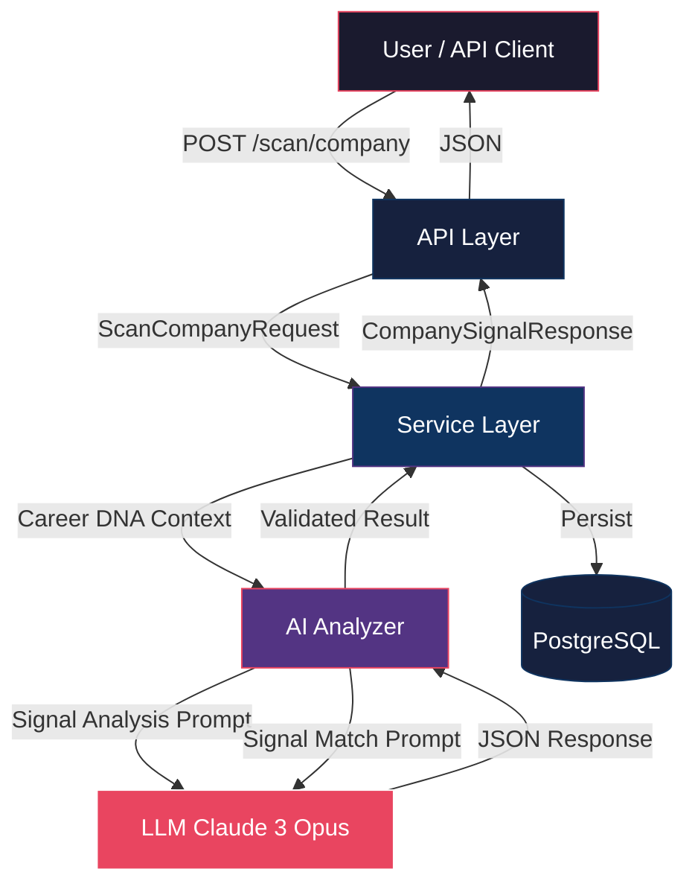

# Sprint 15 — Hidden Job Market Detector™ Architecture

> **Phase C · Network Intelligence**
> **Sprint:** 15 of 20
> **Status:** Implementation Complete  
> **Dependencies:** Career DNA (Sprint 8), Job aggregation (Sprint 3)

---

## Overview

The Hidden Job Market Detector™ identifies unadvertised job opportunities by monitoring company growth signals and matching them with the user's Career DNA. It generates proactive outreach templates that help users reach companies _before_ positions are publicly listed.

This is the **first feature** in Phase C (Network Intelligence), establishing the signal detection → matching → outreach pipeline that will be extended in subsequent sprints.

---

## Architecture



---

## Data Model (5 Tables)

| Table                          | Purpose                                          | Parent FK           |
| ------------------------------ | ------------------------------------------------ | ------------------- |
| `company_signal`               | Growth/hiring signals detected for a company     | `career_dna.id`     |
| `signal_match_result`          | Career DNA ↔ signal match analysis               | `company_signal.id` |
| `outreach_template`            | AI-generated outreach messages                   | `company_signal.id` |
| `hidden_opportunity`           | Predicted pre-listing opportunities              | `company_signal.id` |
| `hidden_job_market_preference` | User monitoring preferences (1:1 with CareerDNA) | `career_dna.id`     |

### Signal Types (StrEnum)

| Value               | Description                                   |
| ------------------- | --------------------------------------------- |
| `funding`           | New funding rounds, investments, acquisitions |
| `office_expansion`  | New offices, geographic/remote expansion      |
| `key_hire`          | Leadership changes, senior hires              |
| `tech_stack_change` | Technology adoption, modernization            |
| `competitor_layoff` | Competitor downsizing creating talent demand  |
| `revenue_growth`    | Revenue milestones, market expansion          |

### Signal Lifecycle

```
detected → matched → actioned/dismissed/expired
```

---

## AI Pipeline (4 Prompts)

| Prompt                           | Purpose                        | Temperature | Confidence Cap |
| -------------------------------- | ------------------------------ | ----------- | -------------- |
| `COMPANY_SIGNAL_ANALYSIS_PROMPT` | Detect growth signals          | 0.5         | 0.85           |
| `SIGNAL_MATCH_PROMPT`            | Match signal to Career DNA     | 0.4         | 1.0 (scores)   |
| `OUTREACH_GENERATION_PROMPT`     | Generate personalized outreach | 0.6         | 0.85           |
| `OPPORTUNITY_SURFACING_PROMPT`   | Predict hidden opportunities   | 0.5         | 0.85           |

### Confidence Computation

```
signal_confidence = 0.40 × llm_confidence
                  + 0.35 × signal_strength
                  + 0.25 × career_dna_completeness
                  clamped to [0.0, 0.85]
```

---

## API Endpoints (11)

| Method | Path                     | Description                              |
| ------ | ------------------------ | ---------------------------------------- |
| `GET`  | `/dashboard`             | Dashboard with all signals + preferences |
| `POST` | `/scan/company`          | Scan company for growth signals          |
| `POST` | `/scan/industry`         | Scan industry for signals                |
| `GET`  | `/preferences`           | Get monitoring preferences               |
| `PUT`  | `/preferences`           | Update monitoring preferences            |
| `POST` | `/compare`               | Compare signals side-by-side             |
| `GET`  | `/opportunities`         | Aggregated opportunity radar             |
| `POST` | `/opportunities/surface` | Surface hidden opportunities             |
| `GET`  | `/{signal_id}`           | Signal detail with match + outreach      |
| `POST` | `/{signal_id}/outreach`  | Generate outreach template               |
| `POST` | `/{signal_id}/dismiss`   | Dismiss or action a signal               |

All endpoints require JWT authentication. Scan/outreach endpoints are rate-limited to 3/minute.

---

## File Structure

```
apps/api/app/
├── models/hidden_job_market.py          # 5 models + 4 StrEnums (~620 lines)
├── schemas/hidden_job_market.py         # 15 Pydantic schemas (~275 lines)
├── ai/hidden_job_market_prompts.py      # 4 versioned prompt templates
├── ai/hidden_job_market_analyzer.py     # 4 LLM + 4 static + 4 validators
├── services/hidden_job_market_service.py # Pipeline orchestration
├── api/v1/hidden_job_market.py          # 11 REST endpoints
└── tests/test_hidden_job_market.py      # ~50 unit tests
alembic/versions/
└── 4d5e6f7g8h9i_add_hidden_job_market_tables.py
```

---

## Ethics & Transparency

| Concern         | Mitigation                                                                 |
| --------------- | -------------------------------------------------------------------------- |
| Privacy         | All signals based on public data; no scraping, no PII                      |
| AI bias         | Multi-signal fusion; no single-signal decisions                            |
| Outreach spam   | Rate limits (3/min), max_outreach_per_week default=5, human review default |
| Signal accuracy | 0.85 confidence cap, mandatory disclaimers, data_source attribution        |
| User autonomy   | Opt-in monitoring, dismiss/action controls, configurable thresholds        |

---

## Dependencies

- **Career DNA** (Sprint 8) — `back_populates` relationships for `company_signals` and `hidden_job_market_preference`
- **Job Aggregation** (Sprint 3) — Potential future integration for signal validation
- **Salary Intelligence** (Sprint 11) — Salary range predictions in opportunities
