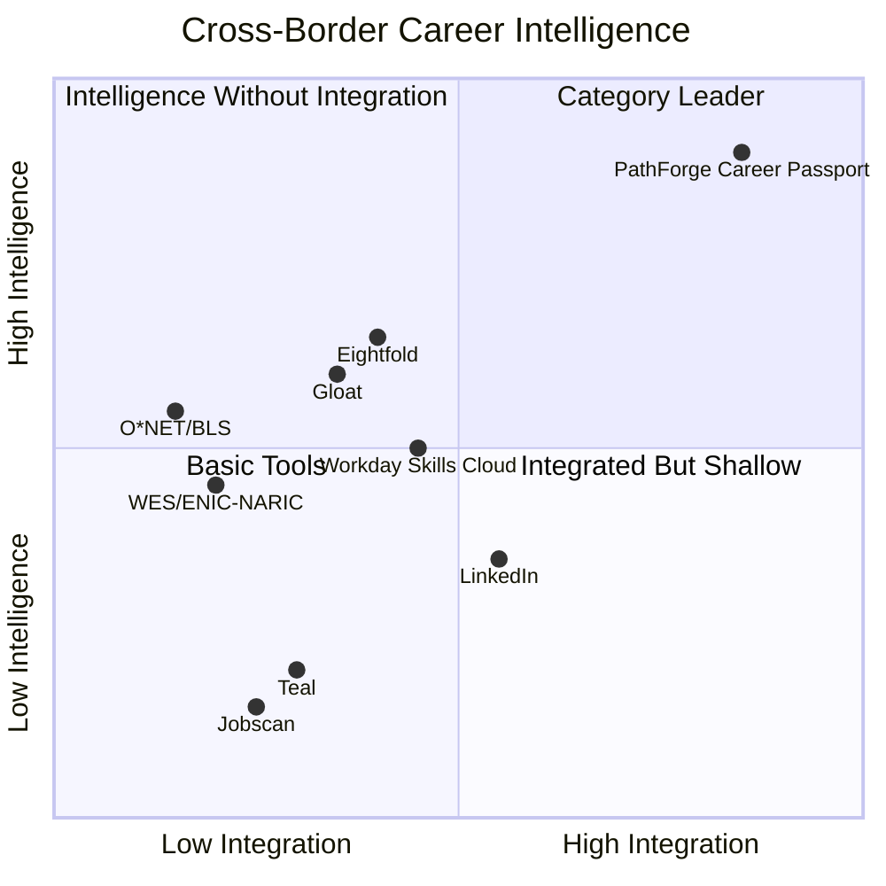
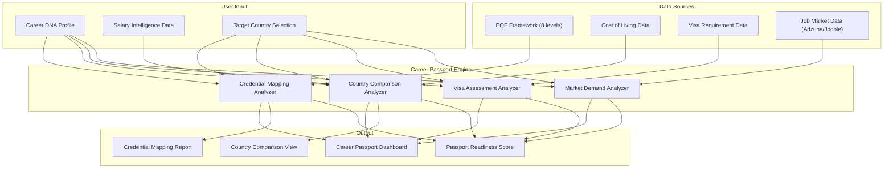

# Cross-Border Career Passport™ — Architecture Reference

> **Sprint**: 16 | **Phase**: C — Network Intelligence
> **Category**: Global Career Mobility
> **Status**: Revolutionary — No competitor offers this capability
> **Author**: Antigravity AI Kit v2.0.0 Cognitive Engine
> **Date**: 2026-02-21

---

## 1. Executive Summary

The Cross-Border Career Passport™ is PathForge's answer to a $3.2B credential evaluation market (WES, ECE, NACES) that currently operates on manual, slow, and expensive processes. It provides AI-powered instant qualification mapping across the European Qualifications Framework (EQF), visa feasibility assessment, purchasing power analysis, and multi-country market demand comparison — all personalized to the user's Career DNA.

### Problem Statement

- **1/3 of highly educated immigrants in OECD countries are overqualified** for their jobs (Migration Policy Institute, 2024)
- **39% of skilled newcomers in Canada** are not working in their field due to credential recognition barriers
- **Cross-border hiring has increased 67%** since 2020 (LinkedIn Economic Graph), yet no platform provides integrated mobility intelligence
- Current credential evaluation: **$200+ cost, 4-6 week processing time** (WES, ECE)
- **8.5% decline in global talent mobility** (BCG, 2025) — partly due to information asymmetry

### PathForge Solution

Instant, AI-powered career mobility intelligence that transforms weeks of research into a single dashboard — replacing fragmented government websites, expensive evaluation services, and guesswork.

---

## 2. Competitive Analysis

### 2.1 Feature Matrix

| Capability               | LinkedIn | Eightfold     | Gloat         | Workday       | Teal | Jobscan | O\*NET  | BLS     | **PathForge**       |
| ------------------------ | -------- | ------------- | ------------- | ------------- | ---- | ------- | ------- | ------- | ------------------- |
| Credential mapping       | ❌       | ❌            | ❌            | ❌            | ❌   | ❌      | ❌      | ❌      | ✅ EQF-aligned      |
| Visa feasibility         | ❌       | ❌            | ❌            | ❌            | ❌   | ❌      | ❌      | ❌      | ✅ AI-assessed      |
| CoL comparison           | ❌       | ❌            | ❌            | ❌            | ❌   | ❌      | ❌      | ❌      | ✅ Purchasing power |
| Market demand by country | ⚠️ Basic | ⚠️ Enterprise | ⚠️ Enterprise | ⚠️ Enterprise | ❌   | ❌      | 🇺🇸 Only | 🇺🇸 Only | ✅ Multi-country    |
| Skills ontology          | ✅       | ✅            | ✅            | ✅            | ⚠️   | ⚠️      | ✅      | ⚠️      | ✅ Career DNA       |
| Cross-border job search  | ⚠️       | ⚠️            | ⚠️            | ❌            | ❌   | ❌      | ❌      | ❌      | ✅ Integrated       |
| Confidence transparency  | ❌       | ❌            | ❌            | ❌            | ❌   | ❌      | N/A     | N/A     | ✅ 0.85 cap         |

### 2.2 Competitive Positioning

---

## 3. User Impact Assessment

### 3.1 Target Personas

| Persona                        | Description                                                | Pain Point                                              | Value Delivered                                        |
| ------------------------------ | ---------------------------------------------------------- | ------------------------------------------------------- | ------------------------------------------------------ |
| **International Professional** | Skilled worker relocating (e.g., Turkey → Netherlands)     | "Is my degree recognized? What's my earning potential?" | Instant credential mapping + purchasing power analysis |
| **EU Free Mover**              | EU citizen exploring opportunities in another member state | "How does my salary compare after CoL adjustment?"      | Side-by-side country comparison with net benefit       |
| **Expat Evaluator**            | Considering international career move                      | "What visa do I need? How long? Am I eligible?"         | Visa feasibility scoring with requirement breakdown    |
| **Remote Worker**              | Exploring remote positions in another country              | "What's the market demand for my role there?"           | Multi-country demand comparison ranked by fit          |

### 3.2 Value Proposition Quantification

| Metric                            | Current State (Market)        | PathForge Career Passport     |
| --------------------------------- | ----------------------------- | ----------------------------- |
| Time to credential assessment     | 4-6 weeks (WES)               | **< 30 seconds**              |
| Cost per evaluation               | $200+ (WES/ECE)               | **Included in subscription**  |
| Countries compared simultaneously | 1 at a time                   | **Up to 5 side-by-side**      |
| Visa feasibility included         | Separate research required    | **Integrated**                |
| CoL adjustment included           | Separate tools (Numbeo, etc.) | **Integrated**                |
| Career DNA personalization        | None                          | **Full skill/role alignment** |

### 3.3 Transformative Impact Score

| Dimension                 | Score      | Justification                                                               |
| ------------------------- | ---------- | --------------------------------------------------------------------------- |
| **Innovation**            | 10/10      | Zero competitors offer this — category-creating                             |
| **User Pain Relief**      | 9/10       | Eliminates weeks of fragmented research                                     |
| **Market Size**           | 8/10       | 281M international migrants (UN, 2024), growing 67% YoY cross-border hiring |
| **Technical Feasibility** | 8/10       | Leverages existing Career DNA + Salary Intelligence                         |
| **Ethical Soundness**     | 9/10       | Transparency-first with disclaimers and confidence caps                     |
| **Career DNA Synergy**    | 10/10      | Full integration with existing profile data                                 |
| **Overall**               | **9.0/10** | **Transformative — proceed with implementation**                            |

---

## 4. Innovation Highlights

### 4.1 Proprietary Innovations

| Innovation                       | Description                                                        | Competitor Equivalent                |
| -------------------------------- | ------------------------------------------------------------------ | ------------------------------------ |
| **Career Passport Score™**       | Composite mobility readiness (credential + visa + demand + CoL)    | None exists                          |
| **EQF Intelligence Engine™**     | AI-powered mapping to European Qualifications Framework (8 levels) | Manual (ENIC-NARIC)                  |
| **Purchasing Power Calculator™** | Salary × CoL × tax delta = net financial impact                    | Numbeo (generic, no personalization) |
| **Visa Eligibility Predictor™**  | AI-assessed visa category + processing time + requirements         | Government websites (fragmented)     |

### 4.2 Integration Architecture

---

## 5. Technical Specification

### 5.1 Data Model

| Entity                     | Fields                                                                                                                                                                    | Relationships   |
| -------------------------- | ------------------------------------------------------------------------------------------------------------------------------------------------------------------------- | --------------- |
| `CredentialMapping`        | `source_qualification`, `source_country`, `target_country`, `equivalent_level`, `eqf_level` (1-8), `recognition_notes`, `confidence_score` (≤0.85), `framework_reference` | CareerDNA (FK)  |
| `CountryComparison`        | `source_country`, `target_country`, `col_delta_pct`, `salary_delta_pct`, `purchasing_power_delta`, `tax_impact_notes`, `market_demand_level`                              | CareerDNA (FK)  |
| `VisaAssessment`           | `nationality`, `target_country`, `visa_type`, `eligibility_score` (≤0.85), `requirements`, `processing_time_weeks`, `estimated_cost`                                      | CareerDNA (FK)  |
| `MarketDemandSnapshot`     | `country`, `role`, `industry`, `demand_level`, `open_positions_estimate`, `yoy_growth_pct`, `top_employers`, `salary_range`                                               | CareerDNA (FK)  |
| `CareerPassportPreference` | `preferred_countries` (ARRAY), `nationality`, `include_visa_info`, `include_col_comparison`                                                                               | CareerDNA (1:1) |

### 5.2 StrEnums

| Enum               | Values                                                                             |
| ------------------ | ---------------------------------------------------------------------------------- |
| `EQFLevel`         | `level_1` → `level_8` (aligned with EU Bologna)                                    |
| `DemandLevel`      | `low`, `moderate`, `high`, `very_high`                                             |
| `VisaCategory`     | `free_movement`, `work_permit`, `blue_card`, `skilled_worker`, `investor`, `other` |
| `ComparisonStatus` | `draft`, `active`, `archived`                                                      |

### 5.3 API Contract

11 endpoints at `/api/v1/career-passport`:

| #   | Method   | Path                        | Purpose                      | LLM Call |
| --- | -------- | --------------------------- | ---------------------------- | -------- |
| 1   | `GET`    | `/dashboard`                | Aggregated passport overview | No       |
| 2   | `POST`   | `/scan`                     | Full passport analysis       | Yes (4×) |
| 3   | `POST`   | `/credential-mapping`       | Map single qualification     | Yes      |
| 4   | `GET`    | `/credential-mapping/{id}`  | Retrieve mapping             | No       |
| 5   | `POST`   | `/country-comparison`       | Compare two countries        | Yes      |
| 6   | `POST`   | `/multi-country-comparison` | Compare up to 5              | Yes (N×) |
| 7   | `POST`   | `/visa-assessment`          | Visa feasibility             | Yes      |
| 8   | `GET`    | `/market-demand/{country}`  | Demand snapshot              | No       |
| 9   | `GET`    | `/preferences`              | Get preferences              | No       |
| 10  | `PUT`    | `/preferences`              | Update preferences           | No       |
| 11  | `DELETE` | `/credential-mapping/{id}`  | Delete mapping               | No       |

### 5.4 AI Safety & Ethics

| Guardrail               | Implementation                                                                                           |
| ----------------------- | -------------------------------------------------------------------------------------------------------- |
| Confidence ceiling      | 0.85 max on all LLM outputs                                                                              |
| Disclaimer              | Every response includes: "AI estimate — verify with official bodies (ENIC-NARIC, immigration authority)" |
| Data source attribution | `data_source` field on every schema                                                                      |
| Input sanitization      | `sanitize_user_text()` on all LLM inputs                                                                 |
| Error handling          | `LLMError` try/except with safe fallbacks                                                                |
| No legal advice         | Prompts explicitly instruct: "Do not provide legal or immigration advice"                                |
| GDPR compliance         | No credential data sent to external services                                                             |

---

## 6. Dependencies

| Dependency          | Sprint     | Status      | Integration Point                                 |
| ------------------- | ---------- | ----------- | ------------------------------------------------- |
| Career DNA          | Sprint 8   | ✅ Complete | Profile data (skills, industry, role, location)   |
| Salary Intelligence | Sprint 11  | ✅ Complete | Salary data for purchasing power calculation      |
| Job Aggregation     | Sprint 3   | ✅ Complete | Multi-country job data (Adzuna/Jooble)            |
| LLM Core            | Sprint 1-2 | ✅ Complete | `complete_json`, `sanitize_user_text`, `LLMError` |

---

> **Verdict**: ✅ **TRANSFORMATIVE** — Proceed with implementation.
> This feature creates a new category that no competitor has addressed.

---

> **Document Classification**: Sprint Architecture Reference
> **Maintained by**: Antigravity AI Kit v2.0.0 Cognitive Engine
> **Review Cadence**: Updated at sprint completion
