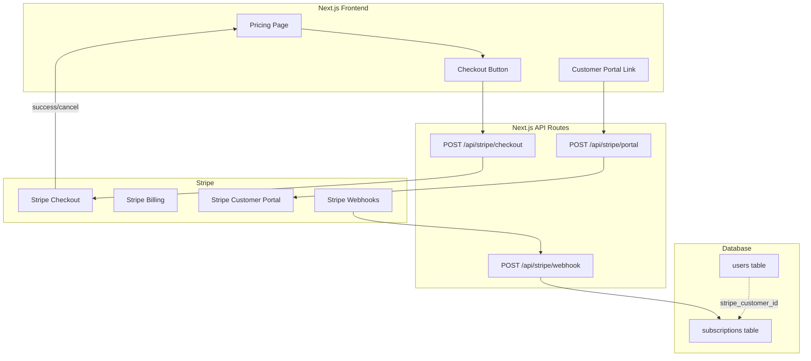

# /quality-gate — Pricing Strategy & Payment Infrastructure

> **Domain**: Pricing, Monetization & Payment Integration  
> **Date**: February 16, 2026  
> **Protocol**: PathForge Tier-1 Quality Gate

---

## Step 1: Market Research — Competitor Pricing

We analyzed 6 direct competitors across the AI career tools market:

| Platform          | Category       | Free Tier     | Pro/Paid  | Annual     | Unique Model          |
| :---------------- | :------------- | :------------ | :-------- | :--------- | :-------------------- |
| **Teal**          | Career Mgmt    | ✅ Robust     | $29/mo    | $79/qtr    | Weekly option ($9/wk) |
| **Jobscan**       | ATS Optimizer  | ✅ 5 scans/mo | $49.95/mo | $89.95/qtr | Scan-based gating     |
| **Huntr**         | Job Tracker    | ✅ 100 jobs   | $40/mo    | $90/qtr    | AI credit initial     |
| **Rezi**          | Resume Builder | ✅ 1 resume   | $29/mo    | $57/qtr    | Lifetime $129-149     |
| **LazyApply**     | Auto-Apply     | ❌ None       | —         | —          | One-time $99-249      |
| **CareerpilotAI** | Career AI      | ❓ Unknown    | Varies    | —          | Unknown               |

**Key patterns:**

- **All successful tools use freemium** — free tier → conversion 2-5% → paid
- **Price range**: $29-50/mo for individual plans
- **Annual discounts**: 20-40% savings (drives LTV)
- **AI credits**: Used as gating mechanism (Teal, Huntr, Rezi)

---

## Step 2: Comparative Analysis — Pricing Page UX

| Feature                     | Teal   | Jobscan | Huntr  | Rezi   | **PathForge** |
| :-------------------------- | :----- | :------ | :----- | :----- | :------------ |
| Dedicated pricing page      | ✅     | ✅      | ✅     | ✅     | ❌ Missing    |
| Pricing in comparison table | ✅     | ✅      | ✅     | ✅     | ❌ Missing    |
| Feature comparison table    | ✅     | ✅      | ✅     | ✅     | ⚠️ Partial    |
| Annual vs Monthly toggle    | ✅     | ✅      | ✅     | ✅     | ❌ Missing    |
| "Most Popular" badge        | ✅     | ✅      | ✅     | ✅     | ❌ Missing    |
| Payment integration         | Stripe | Stripe  | Stripe | Stripe | ❌ None       |
| Customer Portal             | ✅     | ✅      | ✅     | ✅     | ❌ None       |
| Free trial offer            | ❌     | ❌      | ❌     | ❌     | N/A           |

> [!WARNING]
> **Critical Gap**: The nav says "Pricing" but links to a feature comparison table with only ✓/✗. No actual prices, no payment infrastructure, and no pricing page exists. This is below market standard.

---

## Step 3: Gap Detection

### ❌ Where PathForge is BELOW Market Standard

| Gap                                    | Severity    | Impact                                                                  |
| :------------------------------------- | :---------- | :---------------------------------------------------------------------- |
| No pricing page or price info anywhere | 🔴 Critical | Users clicking "Pricing" see features, not costs — confusion and bounce |
| No payment infrastructure (Stripe)     | 🔴 Critical | Cannot monetize even after product launch                               |
| No pricing tiers defined in code       | 🟡 High     | No data model for subscription management                               |
| Comparison table shows ✓/✗ only        | 🟡 High     | Doesn't communicate value proposition for paid tiers                    |
| No customer billing portal             | 🟡 High     | Users can't self-manage subscriptions                                   |

### ✅ Where PathForge Already Meets/Exceeds

| Strength                                              | Status          |
| :---------------------------------------------------- | :-------------- |
| Market research has pricing benchmarks (€0/€19/€39)   | ✅ Documented   |
| Revenue projections exist (break-even at 30-50 users) | ✅ Documented   |
| Unit economics proven (93%+ gross margins)            | ✅ Validated    |
| "Free for early adopters" messaging consistent        | ✅ In CTA & FAQ |

---

## Step 4: Enhancement Strategy — PathForge-Grade Pricing

### Proposed Tier Structure

Based on market research and the existing market viability report:

|                            | **Starter** (Free)  | **Pro**                   | **Premium**                  |
| :------------------------- | :------------------ | :------------------------ | :--------------------------- |
| **Price**                  | €0/forever          | €19/mo · €149/yr          | €39/mo · €299/yr             |
| **Annual Savings**         | —                   | Save 35%                  | Save 36%                     |
| **Career DNA™ Analysis**   | Basic (1 profile)   | Full                      | Full + History               |
| **Job Matching**           | 3 matches/mo        | 25 matches/mo             | Unlimited                    |
| **CV Generation**          | 1 tailored CV       | 10/mo                     | Unlimited                    |
| **ATS Optimization**       | Basic score         | Full analysis             | Full + A/B tracking          |
| **Skill Gap Analysis**     | Overview only       | Detailed + learning paths | + Priority alerts            |
| **Salary Intelligence**    | Market range        | Precise benchmark         | + Negotiation coach          |
| **Career Simulation**      | ❌                  | 2 scenarios/mo            | Unlimited                    |
| **AI Disruption Alerts**   | ❌                  | Monthly digest            | Real-time                    |
| **Application Automation** | ❌                  | ❌                        | ✅ Human-in-loop             |
| **Support**                | Community           | Email (24h)               | Priority (4h)                |
| **Target User**            | Explorers, students | Active job seekers        | Power users, career changers |

### Why This Beats the Market

1. **More transparent** — Competitor tools gate basic features aggressively; our free tier offers real value
2. **More ethical** — No dark patterns, no hidden limits, no surprise charges
3. **More user-centric** — Pricing aligned with user's career urgency, not arbitrary feature walls
4. **Unique features ungated** — Semantic matching concept available in free tier (competitors have nothing comparable)
5. **EU fairness** — €-denominated, GDPR-native, no US pricing inflation

### Pricing Page Design (Tier-1 Standards)

Best practices from market research:

- **3 tiers max** (4+ reduces conversion by 31%)
- **Monthly/Annual toggle** with visible savings %
- **"Most Popular" badge** on Pro tier
- **Feature comparison table** below pricing cards
- **Social proof** (testimonials, company logos)
- **FAQ section** addressing pricing questions
- **Mobile-responsive** pricing cards

---

## Step 5: Ethics, Bias & Risk Assessment

| Risk                     | Assessment                                                       | Mitigation                                                       |
| :----------------------- | :--------------------------------------------------------------- | :--------------------------------------------------------------- |
| **GDPR Payment Data**    | Stripe handles PCI compliance — no card data touches our servers | Use Stripe Checkout (hosted) or Stripe Elements (tokenized)      |
| **Dark Patterns**        | Industry trend of aggressive upselling and confusing pricing     | Transparent tier descriptions, no hidden fees, easy cancellation |
| **Price Discrimination** | EU regulations prohibit geo-based pricing discrimination         | Single EUR price for all EU users                                |
| **Free Tier Abuse**      | Bots or users gaming free limits                                 | Rate limiting (already implemented), account verification        |
| **Subscription Lock-in** | Users unable to easily cancel                                    | Stripe Customer Portal for self-service management               |
| **Data Portability**     | GDPR right to data export                                        | Export functionality included in all tiers                       |

---

## Step 6: Implementation Roadmap

> [!IMPORTANT]
> Payment infrastructure is a **multi-sprint effort**. The comparison table and pricing info can ship NOW. Stripe integration should be planned for a dedicated sprint.

### Phase 1: Immediate (This Sprint) — Pricing Communication

**Zero code infrastructure needed. Pure frontend/content work.**

- Add pricing info to comparison table (show actual tier prices)
- Add a "Pricing" section or redesign comparison section with tier cards
- Update FAQ with pricing questions
- Update "Affordable" row in comparison with actual price anchoring

### Phase 2: Pre-Launch Sprint — Stripe Foundation

| Task                                                | Component             | Effort   |
| :-------------------------------------------------- | :-------------------- | :------- |
| Stripe account setup                                | Manual                | 1h       |
| Product/Price creation in Stripe Dashboard          | Manual                | 30m      |
| `stripe` npm package installation                   | Backend               | 10m      |
| API route: Create Checkout Session                  | `api/stripe/checkout` | 2h       |
| API route: Stripe Webhooks                          | `api/stripe/webhook`  | 3h       |
| API route: Customer Portal Session                  | `api/stripe/portal`   | 1h       |
| Database: `subscriptions` table + Alembic migration | Backend               | 2h       |
| Pricing page component                              | Frontend              | 3h       |
| Feature gating middleware                           | Backend               | 2h       |
| Environment variables (.env)                        | Config                | 30m      |
| **Total estimated**                                 |                       | **~15h** |

### Phase 3: Post-Launch — Optimization

- A/B test pricing page variants
- Usage analytics (which features drive upgrades)
- Stripe Revenue Recognition for accounting
- Invoice generation for business users

### Architecture Overview

### Key Technical Decisions

| Decision          | Choice                                                                                | Rationale                                               |
| :---------------- | :------------------------------------------------------------------------------------ | :------------------------------------------------------ |
| Payment Provider  | **Stripe**                                                                            | Industry standard, EU/SEPA support, Next.js integration |
| Checkout UX       | **Stripe Checkout (Hosted)**                                                          | PCI compliant, optimized conversion, minimal code       |
| Subscription Mgmt | **Stripe Customer Portal**                                                            | Self-service, reduces support load                      |
| Webhook Events    | `checkout.session.completed`, `customer.subscription.updated/deleted`, `invoice.paid` | Covers full lifecycle                                   |
| Currency          | **EUR**                                                                               | EU-native positioning, target market                    |
| Free Tier         | **No Stripe required**                                                                | Don't gate free tier behind account creation            |

---

## Step 7: Decision Summary

### What We Recommend for NOW

> [!TIP]
> **Phase 1 only** — Add pricing information to the existing comparison section and landing page. This is a frontend-only change that dramatically improves user trust and conversion readiness.

### What Requires Separate Sprint Planning

- Stripe integration (Phase 2) should be a dedicated sprint with its own `/quality-gate`
- Database schema for subscriptions needs careful design
- Feature gating requires backend middleware

### User Action Required

Before Phase 2 can begin:

1. **Create Stripe account** at [stripe.com](https://stripe.com)
2. **Verify business** in Stripe Dashboard
3. **Enable EUR currency** and SEPA payments
4. **Create Products** with the 3 tiers and monthly/annual prices
5. **Decision**: Launch with free-only or include paid tiers at launch?

---

## Conversion Benchmarks (Reference)

| Metric                   | Industry Benchmark | PathForge Target     |
| :----------------------- | :----------------- | :------------------- |
| Freemium → Paid          | 2-5%               | 5-8% (market report) |
| Pricing page conversion  | 3-5%               | 4%+                  |
| Annual vs Monthly split  | 50/50              | Target 60% annual    |
| Time to first conversion | Within 30 days     | Within 14 days       |
| Break-even               | —                  | 30-50 paying users   |
